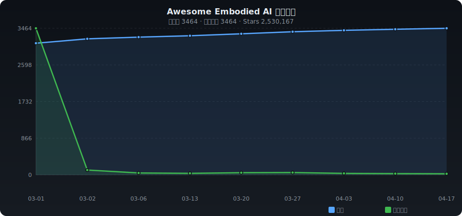

# ✨ Awesome Embodied AI

**English** | [中文](./README_ZH.md)

> Curated collection of Embodied AI — humanoid robots, RL, manipulation, sim-to-real & more

   

---

## 📈 Trends

---

## 📊 Category Stats

| Category | Count | Share |
|----------|------:|------:|
| 🤖 Humanoid Robots | 497 | █████ 16.0% |
| 🐕 Quadruped Robots | 136 | █ 4.4% |
| 🤲 Dexterous Manipulation | 420 | ████ 13.5% |
| 🎯 Reinforcement Learning | 771 | ████████ 24.8% |
| 🧠 Imitation Learning & Foundation Models | 147 | █ 4.7% |
| 🌐 Simulation & Sim-to-Real | 287 | ███ 9.2% |
| 🗺️ Navigation & SLAM | 176 | █ 5.7% |
| 📊 Datasets & Benchmarks | 60 | █ 1.9% |
| 🔩 Hardware & Open-source Robots | 231 | ██ 7.4% |
| 📦 Others | 387 | ████ 12.4% |

---

## 🔥 Daily Trending (2026-03-01)

| # | Project | ⭐ | 📈 Gain | Description |
|:-:|---------|---:|-------:|-------------|
| 1 | [sindresorhus/awesome](https://github.com/sindresorhus/awesome) | 441,523 | 🆕 | 😎 Awesome lists about all kinds of interesting topics |
| 2 | [josephmisiti/awesome-machine-learning](https://github.com/josephmisiti/awesome-machine-learning) | 71,775 | 🆕 | A curated list of awesome Machine Learning frameworks, libra |
| 3 | [protocolbuffers/protobuf](https://github.com/protocolbuffers/protobuf) | 70,768 | 🆕 | Protocol Buffers - Google's data interchange format |
| 4 | [localstack/localstack](https://github.com/localstack/localstack) | 64,509 | 🆕 | 💻 A fully functional local AWS cloud stack. Develop and test |
| 5 | [coqui-ai/TTS](https://github.com/coqui-ai/TTS) | 44,673 | 🆕 | 🐸💬 - a deep learning toolkit for Text-to-Speech, battle-test |
| 6 | [mudler/LocalAI](https://github.com/mudler/LocalAI) | 43,157 | 🆕 | :robot: The free, Open Source alternative to OpenAI, Claude  |
| 7 | [google-research/bert](https://github.com/google-research/bert) | 39,875 | 🆕 | TensorFlow code and pre-trained models for BERT |
| 8 | [google-research/google-research](https://github.com/google-research/google-research) | 37,373 | 🆕 | Google Research |
| 9 | [openai/gym](https://github.com/openai/gym) | 37,057 | 🆕 | A toolkit for developing and comparing reinforcement learnin |
| 10 | [microsoft/visual-chatgpt](https://github.com/chenfei-wu/TaskMatrix) | 34,244 | 🆕 |  |
| 11 | [FreeCAD/FreeCAD](https://github.com/FreeCAD/FreeCAD) | 28,807 | 🆕 | Official source code of FreeCAD, a free and opensource multi |
| 12 | [AtsushiSakai/PythonRobotics](https://github.com/AtsushiSakai/PythonRobotics) | 28,757 | 🆕 | Python sample codes and textbook for robotics algorithms. |
| 13 | [Genesis-Embodied-AI/Genesis](https://github.com/Genesis-Embodied-AI/Genesis) | 28,202 | 🆕 | A generative world for general-purpose robotics & embodied A |
| 14 | [ChristosChristofidis/awesome-deep-learning](https://github.com/ChristosChristofidis/awesome-deep-learning) | 27,629 | 🆕 | A curated list of awesome Deep Learning tutorials, projects  |
| 15 | [tzutalin/labelImg](https://github.com/HumanSignal/labelImg) | 24,803 | 🆕 | LabelImg is now part of the Label Studio community. The popu |
| 16 | [imthenachoman/How-To-Secure-A-Linux-Server](https://github.com/imthenachoman/How-To-Secure-A-Linux-Server) | 24,641 | 🆕 | An evolving how-to guide for securing a Linux server. |
| 17 | [mlflow/mlflow](https://github.com/mlflow/mlflow) | 24,485 | 🆕 | The open source developer platform to build AI agents and mo |
| 18 | [semantic-release/semantic-release](https://github.com/semantic-release/semantic-release) | 23,369 | 🆕 | :package::rocket: Fully automated version management and pac |
| 19 | [jbhuang0604/awesome-computer-vision](https://github.com/jbhuang0604/awesome-computer-vision) | 23,090 | 🆕 | A curated list of awesome computer vision resources |
| 20 | [huggingface/lerobot](https://github.com/huggingface/lerobot) | 21,879 | 🆕 | 🤗 LeRobot: Making AI for Robotics more accessible with end-t |

---

## 📁 Categories

- [🤖 Humanoid Robots](#humanoid) (497)
- [🐕 Quadruped Robots](#quadruped) (136)
- [🤲 Dexterous Manipulation](#dexterous) (420)
- [🎯 Reinforcement Learning](#rl) (771)
- [🧠 Imitation Learning & Foundation Models](#imitation) (147)
- [🌐 Simulation & Sim-to-Real](#sim2real) (287)
- [🗺️ Navigation & SLAM](#navigation) (176)
- [📊 Datasets & Benchmarks](#dataset) (60)
- [🔩 Hardware & Open-source Robots](#hardware) (231)
- [📦 Others](#other) (387)

---

### 🤖 Humanoid Robots

| Project | ⭐ | Language | Description |
|---------|---:|:--------:|-------------|
| [PetoiCamp/OpenCat-Quadruped-Robot](https://github.com/PetoiCamp/OpenCat-Quadruped-Robot) | 4,647 | C++ | An open source quadruped robot pet framework for developing Boston Dyn |
| [leggedrobotics/legged_gym](https://github.com/leggedrobotics/legged_gym) | 2,720 | Python | Isaac Gym Environments for Legged Robots |
| [Nate711/StanfordDoggoProject](https://github.com/Nate711/StanfordDoggoProject) | 2,504 | - | Stanford Doggo is an open source quadruped robot that jumps, flips, an |
| [leggedrobotics/rsl_rl](https://github.com/leggedrobotics/rsl_rl) | 2,280 | Python | A fast and simple implementation of learning algorithms for robotics. |
| [roboterax/humanoid-gym](https://github.com/roboterax/humanoid-gym) | 1,861 | Python | Humanoid-Gym: Reinforcement Learning for Humanoid Robot with Zero-Shot |
| [magicleap/Atlas](https://github.com/magicleap/Atlas) | 1,852 | Python | Atlas: End-to-End 3D Scene Reconstruction from Posed Images |
| [YanjieZe/awesome-humanoid-robot-learning](https://github.com/YanjieZe/awesome-humanoid-robot-learning) | 1,794 | Python | A Paper List for Humanoid Robot Learning. |
| [YanjieZe/GMR](https://github.com/YanjieZe/GMR) | 1,758 | Python | [ICRA 2026] GMR: General Motion Retargeting. Retarget human motions in |
| [qiayuanl/legged_control](https://github.com/qiayuanl/legged_control) | 1,594 | C++ | NMPC, WBC, state estimation, and sim2real framework for legged robots  |
| [Skythinker616/foc-wheel-legged-robot](https://github.com/Skythinker616/foc-wheel-legged-robot) | 1,529 | C | Open source materials for a novel structured legged robot, including m |
| [robot-descriptions/awesome-robot-descriptions](https://github.com/robot-descriptions/awesome-robot-descriptions) | 1,405 | - | A curated list of awesome robot descriptions (URDF, MJCF) |
| [erwincoumans/motion_imitation](https://github.com/erwincoumans/motion_imitation) | 1,389 | Python | Code accompanying the paper "Learning Agile Robotic Locomotion Skills  |
| [PetoiCamp/OpenCat-Old](https://github.com/PetoiCamp/OpenCat-Old) | 1,375 | C++ | A programmable and highly maneuverable robotic cat for STEM education  |
| [Roboparty/roboto_origin](https://github.com/Roboparty/roboto_origin) | 1,313 | Python | Roboto_origin Fully Open-Source DIY Humanoid Robot/萝博头原型机全开源手搓级人形机器人 |
| [unitreerobotics/xr_teleoperate](https://github.com/unitreerobotics/xr_teleoperate) | 1,294 | Python | This repository implements teleoperation of the Unitree humanoid robot |
| [ZhengyiLuo/PHC](https://github.com/ZhengyiLuo/PHC) | 1,183 | Python | Official Implementation of the ICCV 2023 paper:  Perpetual Humanoid Co |
| [robocasa/robocasa](https://github.com/robocasa/robocasa) | 1,144 | Python | RoboCasa: Large-Scale Simulation of Everyday Tasks for Generalist Robo |
| [rohanpsingh/LearningHumanoidWalking](https://github.com/rohanpsingh/LearningHumanoidWalking) | 1,063 | Python | Training a humanoid robot for locomotion using Reinforcement Learning |
| [ethz-adrl/towr](https://github.com/ethz-adrl/towr) | 1,046 | C++ | A light-weight, Eigen-based C++ library for trajectory optimization fo |
| [dorianborian/sesame-robot](https://github.com/dorianborian/sesame-robot) | 1,014 | C | An open and affordable mini quadruped robot based on ESP32. |
| [NVlabs/GR00T-WholeBodyControl](https://github.com/NVlabs/GR00T-WholeBodyControl) | 966 | C++ | Welcome to GR00T Whole-Body Control (WBC)! This is a unified platform  |
| [abizovnuralem/go2_omniverse](https://github.com/abizovnuralem/go2_omniverse) | 956 | Python | Unitree Go2, Unitree G1 support for Nvidia Isaac Lab (Isaac Gym / Isaa |
| [LeCAR-Lab/dial-mpc](https://github.com/LeCAR-Lab/dial-mpc) | 941 | Python | Official implementation for the paper "Full-Order Sampling-Based MPC f |
| [poppy-project/poppy-humanoid](https://github.com/poppy-project/poppy-humanoid) | 872 | Jupyter Notebook | Poppy Humanoid is an open-source and 3D printed humanoid robot. Optimi |
| [jonyzhang2023/awesome-humanoid-learning](https://github.com/jonyzhang2023/awesome-humanoid-learning) | 864 | - | Humanoid Robots Resources |
| [TeleHuman/PBHC](https://github.com/TeleHuman/PBHC) | 744 | Python | Official Implementation of "KungfuBot: Physics-Based Humanoid Whole-Bo |
| [facebookresearch/metamotivo](https://github.com/facebookresearch/metamotivo) | 742 | Python | The first behavioral foundation model to control a virtual physics-bas |
| [hongsukchoi/VideoMimic](https://github.com/hongsukchoi/VideoMimic) | 721 | Python | Visual Imitation Enables Contextual Humanoid Control. CoRL 2025, Best  |
| [AIM-Intelligence/video2robot](https://github.com/AIM-Intelligence/video2robot) | 610 | Python | End-to-end pipeline converting generative videos (Veo, Sora) to humano |
| [Open-X-Humanoid/TienKung-Lab](https://github.com/Open-X-Humanoid/TienKung-Lab) | 596 | Python | Tien Kung-Lab: Direct IsaacLab Workflow for Legged Robots |
| [RobotLocomotion/pytorch-dense-correspondence](https://github.com/RobotLocomotion/pytorch-dense-correspondence) | 577 | Python | Code for "Dense Object Nets:  Learning Dense Visual Object Descriptors |
| [bridgedp/hunter_bipedal_control](https://github.com/bridgedp/hunter_bipedal_control) | 565 | C++ | An open source bipedal robot control framework, based on non-linear MP |
| [LeCAR-Lab/ABS](https://github.com/LeCAR-Lab/ABS) | 555 | Python | [RSS 2024] Agile But Safe: Learning Collision-Free High-Speed Legged L |
| [1x-technologies/1xgpt](https://github.com/1x-technologies/1xgpt) | 554 | Python | world modeling challenge for humanoid robots |
| [unitreerobotics/unitree_IL_lerobot](https://github.com/unitreerobotics/unitree_IL_lerobot) | 554 | Python | The unitree_il_lerobot open-source project is a modification of the Le |
| [Hellod035/LeggedLab](https://github.com/Hellod035/LeggedLab) | 546 | Python | Direct IsaacLab Workflow for Legged Robots |
| [InternRobotics/HoST](https://github.com/InternRobotics/HoST) | 524 | Python | [RSS 2025 Best Systems Paper Finalist] 💐Official implementation of "Le |
| [DRCL-USC/Hector_Simulation](https://github.com/DRCL-USC/Hector_Simulation) | 519 | C++ | Simulation Software (ROS/MATLAB) for HECTOR Humanoid Robot Locomotion  |
| [InternRobotics/OpenHomie](https://github.com/InternRobotics/OpenHomie) | 519 | C++ | Open-sourced code for "HOMIE: Humanoid Loco-Manipulation with Isomorph |
| [engineai-robotics/engineai_legged_gym](https://github.com/engineai-robotics/engineai_legged_gym) | 490 | Python |  |

---

### 🐕 Quadruped Robots

| Project | ⭐ | Language | Description |
|---------|---:|:--------:|-------------|
| [ToanTech/py-apple-quadruped-robot](https://github.com/ToanTech/py-apple-quadruped-robot) | 1,208 | Python | 一个低成本大型全套四足机器人软硬件开源项目 |
| [mjbots/moteus](https://github.com/mjbots/moteus) | 1,107 | C++ | Brushless servo and quadrupedal robot |
| [mangdangroboticsclub/QuadrupedRobot](https://github.com/mangdangroboticsclub/QuadrupedRobot) | 1,083 | Python | Open-Source,ROS Robot Dog Kit |
| [curieuxjy/Awesome_Quadrupedal_Robots](https://github.com/curieuxjy/Awesome_Quadrupedal_Robots) | 1,022 | Python | Awesome Quadrupedal Robots |
| [FlorianWilk/SpotMicroAI](https://github.com/FlorianWilk/SpotMicroAI) | 451 | - | SpotMicro AI - How to build a self-learning Robot |
| [Derek-TH-Wang/quadruped_ctrl](https://github.com/Derek-TH-Wang/quadruped_ctrl) | 349 | C++ | MIT mini cheetah quadruped robot simulated in pybullet environment usi |
| [google-deepmind/barkour_robot](https://github.com/google-deepmind/barkour_robot) | 330 | C++ | Barkour Robot: Agile Quadruped Robots by Google DeepMind |
| [aaedmusa/TOPS](https://github.com/aaedmusa/TOPS) | 284 | C++ | TOPS (Traverser of Planar Surfaces) or "SPOT" backwards is a 3D printe |
| [chvmp/robots](https://github.com/chvmp/robots) | 262 | C | Collection of quadrupedal robots configured to work in CHAMP developme |
| [ShuoYangRobotics/QuadrupedSim](https://github.com/ShuoYangRobotics/QuadrupedSim) | 245 | MATLAB | A quadruped robot simulator in Matlab/Simulink |
| [haraduka/mevius](https://github.com/haraduka/mevius) | 231 | Python | A Quadruped Robot Easily Constructed through E-Commerce with Sheet Met |
| [metadriverse/metaurban](https://github.com/metadriverse/metaurban) | 226 | Python | [ICLR 2025 Spotlight] MetaUrban: An Embodied AI Simulation Platform fo |
| [Tencent-RoboticsX/lifelike-agility-and-play](https://github.com/Tencent-RoboticsX/lifelike-agility-and-play) | 218 | Python | Project Page for Lifelike Agility and Play in Quadrupedal Robots using |
| [SovGVD/esp32-robot-dog-code](https://github.com/SovGVD/esp32-robot-dog-code) | 141 | C++ | WIP: ESP32 powered robot dog, quadruped robot. This is just code, hard |
| [lnotspotl/notspot_sim_py](https://github.com/lnotspotl/notspot_sim_py) | 133 | Python | This repository contains all the code and files needed to simulate the |
| [ViolinLee/NodeQuad12-MicroPython](https://github.com/ViolinLee/NodeQuad12-MicroPython) | 124 | Python | Spider quadruped robot using NodeMUC-32S (ESP32) and MicroPython. |
| [lshil00/Quadruped_robot](https://github.com/lshil00/Quadruped_robot) | 120 | C | a 12-DOF quadruped robot design |
| [golaced/Quadruped-Robot-Moco-12-](https://github.com/golaced/Quadruped-Robot-Moco-12-) | 120 | Python | MOCO通用四足机器人控制器教程 |
| [anoochit/arduino-quadruped-robot](https://github.com/anoochit/arduino-quadruped-robot) | 118 | Arduino | Arduino Quadruped Robot, Spider Robot |
| [ToanTech/py-apple-bldc-quadruped-robot](https://github.com/ToanTech/py-apple-bldc-quadruped-robot) | 112 | C++ | 这是菠萝狗四足机器人开源项目的分支，菠萝无刷系列开源四足机器人的专门仓库 |
| [UMich-CURLY/deep-contact-estimator](https://github.com/UMich-CURLY/deep-contact-estimator) | 111 | Python | Contact estimation for quadruped robots. |
| [iit-DLSLab/muse](https://github.com/iit-DLSLab/muse) | 105 | C++ | A State Estimation Package for Quadruped Robots, that fuses Propriocep |
| [khaledgabr77/unitree_go2_ros2](https://github.com/khaledgabr77/unitree_go2_ros2) | 105 | C++ | The package provides a complete ROS 2 Jazzy integration for the Unitre |
| [facebookresearch/spot-sim2real](https://github.com/facebookresearch/spot-sim2real) | 101 | Python | Spot Sim2Real Infrastructure |
| [alexandrospetkos/quad](https://github.com/alexandrospetkos/quad) | 93 | Processing | Four Legged robot design |
| [ANYbotics/anymal_b_simple_description](https://github.com/ANYbotics/anymal_b_simple_description) | 93 | CMake | Simplified robot description of the ANYmal B quadrupedal robot. |
| [BAO162/Quadruped_MPC_matlab](https://github.com/BAO162/Quadruped_MPC_matlab) | 80 | MATLAB | Quadruped robot linear MPC control, platform Webots + MATLAB |
| [TNY-Robotics/TNY-360](https://github.com/TNY-Robotics/TNY-360) | 74 | C++ | TNY - 360 Robot source code and 3d models |
| [lnotspotl/a1_sim_py](https://github.com/lnotspotl/a1_sim_py) | 73 | Python | This is a temporary repository, which contains all the files needed to |
| [ANYbotics/anymal_c_simple_description](https://github.com/ANYbotics/anymal_c_simple_description) | 72 | CMake | Simplified robot description of the ANYmal C quadrupedal robot. |
| [SoftServeSAG/spot_simulation](https://github.com/SoftServeSAG/spot_simulation) | 70 | - | This repository contains examples of simulation for Boston Dynamic's r |
| [uzh-rpg/event-based_object_catching_anymal](https://github.com/uzh-rpg/event-based_object_catching_anymal) | 69 | C++ | Code for "Event-based Agile Object Catching with a Quadrupedal Robot", |
| [golaced/Moco-8-OpenSourced-Quadruped-Robot](https://github.com/golaced/Moco-8-OpenSourced-Quadruped-Robot) | 61 | C | 全开源8自由度四足机器人  欢迎Star |
| [runeharlyk/SpotMicroESP32-Leika](https://github.com/runeharlyk/SpotMicroESP32-Leika) | 60 | C++ | My take on the quadruped Spot Micro robot. Its built around an ESP32 c |
| [mujocolab/anymal_c_velocity](https://github.com/mujocolab/anymal_c_velocity) | 59 | Python | Integrating a custom robot (ANYmal C) with mjlab's velocity task |
| [JackDemeter/quadruped-robot](https://github.com/JackDemeter/quadruped-robot) | 58 | Jupyter Notebook | Quadruped Robot for capstone project |
| [HitSZwang/mini-cheetah-pybullet](https://github.com/HitSZwang/mini-cheetah-pybullet) | 57 | C++ | mpc and wbc for mini cheetah in pybullet |
| [PingguSoft/esp32_quadruped](https://github.com/PingguSoft/esp32_quadruped) | 56 | C++ | quadrupedal robot using esp32 |
| [ZWT006/agile_navigation](https://github.com/ZWT006/agile_navigation) | 54 | C++ | Quadruped Robot Planning ROS Package |
| [awesomericky/multiple-gait-controller-for-quadruped-robot](https://github.com/awesomericky/multiple-gait-controller-for-quadruped-robot) | 52 | Python | Learning multiple gaits of quadruped robot using hierarchical reinforc |

---

### 🤲 Dexterous Manipulation

| Project | ⭐ | Language | Description |
|---------|---:|:--------:|-------------|
| [MarkFzp/mobile-aloha](https://github.com/MarkFzp/mobile-aloha) | 4,366 | Jupyter Notebook | Mobile ALOHA: Learning Bimanual Mobile Manipulation with Low-Cost Whol |
| [HCPLab-SYSU/Embodied_AI_Paper_List](https://github.com/HCPLab-SYSU/Embodied_AI_Paper_List) | 1,921 | - | [Embodied-AI-Survey-2025] Paper List and Resource Repository for Embod |
| [enactic/openarm](https://github.com/enactic/openarm) | 1,839 | MDX | A fully open-source humanoid arm for physical AI research and deployme |
| [thu-ml/RoboticsDiffusionTransformer](https://github.com/thu-ml/RoboticsDiffusionTransformer) | 1,625 | Python | RDT-1B: a Diffusion Foundation Model for Bimanual Manipulation |
| [Lifelong-Robot-Learning/LIBERO](https://github.com/Lifelong-Robot-Learning/LIBERO) | 1,519 | Jupyter Notebook | Benchmarking Knowledge Transfer in Lifelong Robot Learning |
| [real-stanford/universal_manipulation_interface](https://github.com/real-stanford/universal_manipulation_interface) | 1,264 | Python | Universal Manipulation Interface: In-The-Wild Robot Teaching Without I |
| [facebookresearch/home-robot](https://github.com/facebookresearch/home-robot) | 1,189 | Python | Mobile manipulation research tools for roboticists |
| [andyzeng/visual-pushing-grasping](https://github.com/andyzeng/visual-pushing-grasping) | 1,082 | Python | Train robotic agents to learn to plan pushing and grasping actions for |
| [huangwl18/ReKep](https://github.com/huangwl18/ReKep) | 911 | Python | ReKep: Spatio-Temporal Reasoning of Relational Keypoint Constraints fo |
| [vimalabs/VIMA](https://github.com/vimalabs/VIMA) | 844 | Python | Official Algorithm Implementation of ICML'23 Paper "VIMA: General Robo |
| [mees/calvin](https://github.com/mees/calvin) | 841 | Python | CALVIN - A benchmark for Language-Conditioned Policy Learning for Long |
| [zubair-irshad/Awesome-Robotics-3D](https://github.com/zubair-irshad/Awesome-Robotics-3D) | 796 | - | A curated list of 3D Vision papers relating to Robotics domain in the  |
| [huangwl18/VoxPoser](https://github.com/huangwl18/VoxPoser) | 784 | Python | VoxPoser: Composable 3D Value Maps for Robotic Manipulation with Langu |
| [TheRobotStudio/HOPEJr](https://github.com/TheRobotStudio/HOPEJr) | 752 | C# | HOPEJr_open-source_DIY_Humanoid_Robot_with_dexterous_hands |
| [jimmyyhwu/tidybot](https://github.com/jimmyyhwu/tidybot) | 679 | Python | TidyBot: Personalized Robot Assistance with Large Language Models |
| [jimmyyhwu/tidybot2](https://github.com/jimmyyhwu/tidybot2) | 552 | Python | TidyBot++: An Open-Source Holonomic Mobile Manipulator for Robot Learn |
| [LightwheelAI/leisaac](https://github.com/LightwheelAI/leisaac) | 550 | Python | LeIsaac provides teleoperation functionality in IsaacLab using the SO1 |
| [cliport/cliport](https://github.com/cliport/cliport) | 539 | Jupyter Notebook | CLIPort: What and Where Pathways for Robotic Manipulation |
| [peract/peract](https://github.com/peract/peract) | 483 | Python | Perceiver-Actor: A Multi-Task Transformer for Robotic Manipulation |
| [star2dust/paper-simulation](https://github.com/star2dust/paper-simulation) | 412 | MATLAB | Let's reproduce paper simulations of multi-robot systems, formation co |
| [rhett-chen/Robotic-grasping-papers](https://github.com/rhett-chen/Robotic-grasping-papers) | 390 | - | paper list of robotic grasping and some related works |
| [microsoft/ChatGPT-Robot-Manipulation-Prompts](https://github.com/microsoft/ChatGPT-Robot-Manipulation-Prompts) | 389 | - |  |
| [huangwl18/PointWorld](https://github.com/huangwl18/PointWorld) | 389 | - | PointWorld: Scaling 3D World Models for In-The-Wild Robotic Manipulati |
| [FlagOpen/RoboBrain](https://github.com/FlagOpen/RoboBrain) | 367 | Python | [CVPR 2025] RoboBrain: A Unified Brain Model for Robotic Manipulation  |
| [facebookresearch/r3m](https://github.com/facebookresearch/r3m) | 366 | Python | Pre-training Reusable Representations for Robotic Manipulation Using D |
| [aadhithya14/Open-Teach](https://github.com/aadhithya14/Open-Teach) | 355 | C# | A Versatile Teleoperation framework for Robotic Manipulation using Met |
| [j96w/DexCap](https://github.com/j96w/DexCap) | 353 | Python | [RSS 2024] "DexCap: Scalable and Portable Mocap Data Collection System |
| [JiuTian-VL/Large-VLM-based-VLA-for-Robotic-Manipulation](https://github.com/JiuTian-VL/Large-VLM-based-VLA-for-Robotic-Manipulation) | 348 | - | A curated list of large VLM-based VLA models for robotic manipulation. |
| [wenbowen123/catgrasp](https://github.com/wenbowen123/catgrasp) | 339 | Python | [ICRA 2022] CaTGrasp: Learning Category-Level Task-Relevant Grasping i |
| [AutonoBot-Lab/BestMan](https://github.com/AutonoBot-Lab/BestMan) | 331 | Python | Codebase for the BestMan Mobile Manipulator Platform |
| [vimalabs/VIMABench](https://github.com/vimalabs/VIMABench) | 325 | Python | Official Task Suite Implementation of ICML'23 Paper "VIMA: General Rob |
| [andyzeng/arc-robot-vision](https://github.com/andyzeng/arc-robot-vision) | 320 | Lua | MIT-Princeton Vision Toolbox for Robotic Pick-and-Place at the Amazon  |
| [aravindr93/hand_dapg](https://github.com/aravindr93/hand_dapg) | 306 | Python | Repository to accompany RSS 2018 paper on dexterous hand manipulation |
| [isri-aist/RoboManipBaselines](https://github.com/isri-aist/RoboManipBaselines) | 301 | Python | A software framework integrating various imitation learning methods an |
| [Genesis-Embodied-AI/DiffTactile](https://github.com/Genesis-Embodied-AI/DiffTactile) | 300 | Python | [ICLR 2024] DiffTactile: A Physics-based Differentiable Tactile Simula |
| [bytedance/GR-1](https://github.com/bytedance/GR-1) | 300 | Python | Code for "Unleashing Large-Scale Video Generative Pre-training for Vis |
| [UT-Austin-RPL/deoxys_control](https://github.com/UT-Austin-RPL/deoxys_control) | 297 | Python | A modular, real-time controller library for Franka Emika Panda robots |
| [JamesLLMs/LDM](https://github.com/JamesLLMs/LDM) | 293 | Python | A Lightweight Learning Framework for Dexterous Manipulation |
| [Skylark0924/awesome-bimanual-manipulation](https://github.com/Skylark0924/awesome-bimanual-manipulation) | 289 | - | Robot bimanual manipulation / dual-arm manipulation |
| [ManipTrans/ManipTrans](https://github.com/ManipTrans/ManipTrans) | 287 | Python | [CVPR 2025] 🎉 Official repository of "ManipTrans: Efficient Dexterous  |

---

### 🎯 Reinforcement Learning

| Project | ⭐ | Language | Description |
|---------|---:|:--------:|-------------|
| [localstack/localstack](https://github.com/localstack/localstack) | 64,509 | Python | 💻 A fully functional local AWS cloud stack. Develop and test your clou |
| [openai/gym](https://github.com/openai/gym) | 37,057 | Python | A toolkit for developing and comparing reinforcement learning algorith |
| [Genesis-Embodied-AI/Genesis](https://github.com/Genesis-Embodied-AI/Genesis) | 28,202 | Python | A generative world for general-purpose robotics & embodied AI learning |
| [wekan/wekan](https://github.com/wekan/wekan) | 20,856 | JavaScript | The Open Source kanban, built with Meteor. GitHub issues/PRs are only  |
| [volcengine/verl](https://github.com/verl-project/verl) | 19,481 | Python | verl: Volcano Engine Reinforcement Learning for LLMs |
| [Unity-Technologies/ml-agents](https://github.com/Unity-Technologies/ml-agents) | 19,189 | C# | The Unity Machine Learning Agents Toolkit (ML-Agents) is an open-sourc |
| [lvwerra/trl](https://github.com/huggingface/trl) | 17,485 | Python | Train transformer language models with reinforcement learning. |
| [openai/baselines](https://github.com/openai/baselines) | 16,651 | Python | OpenAI Baselines: high-quality implementations of reinforcement learni |
| [ShangtongZhang/reinforcement-learning-an-introduction](https://github.com/ShangtongZhang/reinforcement-learning-an-introduction) | 14,568 | Python | Python Implementation of Reinforcement Learning: An Introduction |
| [carla-simulator/carla](https://github.com/carla-simulator/carla) | 13,615 | C++ | Open-source simulator for autonomous driving research. |
| [owainlewis/awesome-artificial-intelligence](https://github.com/owainlewis/awesome-artificial-intelligence) | 13,005 | - | A curated list of Artificial Intelligence (AI) courses, books, video l |
| [DLR-RM/stable-baselines3](https://github.com/DLR-RM/stable-baselines3) | 12,798 | Python | PyTorch version of Stable Baselines, reliable implementations of reinf |
| [aikorea/awesome-rl](https://github.com/aikorea/awesome-rl) | 9,587 | - | Reinforcement learning resources curated |
| [OpenRLHF/OpenRLHF](https://github.com/OpenRLHF/OpenRLHF) | 9,060 | Python | An Easy-to-use, Scalable and High-performance Agentic RL Framework bas |
| [openai/universe](https://github.com/openai/universe) | 7,512 | Python | Universe: a software platform for measuring and training an AI's gener |
| [pliang279/awesome-multimodal-ml](https://github.com/pliang279/awesome-multimodal-ml) | 6,820 | - | Reading list for research topics in multimodal machine learning |
| [yandexdataschool/Practical_RL](https://github.com/yandexdataschool/Practical_RL) | 6,439 | Jupyter Notebook | A course in reinforcement learning in the wild |
| [jason718/awesome-self-supervised-learning](https://github.com/jason718/awesome-self-supervised-learning) | 6,362 | - | A curated list of awesome self-supervised methods |
| [CarperAI/trlx](https://github.com/CarperAI/trlx) | 4,740 | Python | A repo for distributed training of language models with Reinforcement  |
| [PKU-Alignment/align-anything](https://github.com/PKU-Alignment/align-anything) | 4,637 | Python | Align Anything: Training All-modality Model with Feedback |
| [opendilab/awesome-RLHF](https://github.com/opendilab/awesome-RLHF) | 4,309 | - | A curated list of reinforcement learning with human feedback resources |
| [GT-RIPL/Awesome-LLM-Robotics](https://github.com/GT-RIPL/Awesome-LLM-Robotics) | 4,282 | - | A comprehensive list of papers using large language/multi-modal models |
| [rlcode/reinforcement-learning](https://github.com/rlcode/reinforcement-learning) | 3,618 | Python | Minimal and Clean Reinforcement Learning Examples |
| [opendilab/DI-engine](https://github.com/opendilab/DI-engine) | 3,598 | Python | OpenDILab Decision AI Engine. The Most Comprehensive Reinforcement Lea |
| [ShangtongZhang/DeepRL](https://github.com/ShangtongZhang/DeepRL) | 3,413 | Python | Modularized Implementation of Deep RL Algorithms in PyTorch |
| [pytorch/rl](https://github.com/pytorch/rl) | 3,322 | Python | A modular, primitive-first, python-first PyTorch library for Reinforce |
| [reinforceio/tensorforce](https://github.com/tensorforce/tensorforce) | 3,312 | Python | Tensorforce: a TensorFlow library for applied reinforcement learning |
| [ob-f/OpenBot](https://github.com/ob-f/OpenBot) | 3,214 | Swift | OpenBot leverages smartphones as brains for low-cost robots. We have d |
| [deepmind/trfl](https://github.com/google-deepmind/trfl) | 3,134 | Python | TensorFlow Reinforcement Learning |
| [tensorflow/agents](https://github.com/tensorflow/agents) | 2,991 | Python | TF-Agents: A reliable, scalable and easy to use TensorFlow library for |
| [endymecy/awesome-deeplearning-resources](https://github.com/endymecy/awesome-deeplearning-resources) | 2,990 | - | Deep Learning and deep reinforcement learning research papers and some |
| [cirosantilli/china-dictatorship](https://github.com/cirosantilli/china-dictatorship) | 2,866 | HTML | 反中共政治宣传库。Anti Chinese government propaganda. 住在中国真名用户的网友请别给星星，不然你要被警察请 |
| [isaac-sim/IsaacGymEnvs](https://github.com/isaac-sim/IsaacGymEnvs) | 2,857 | Python | Isaac Gym Reinforcement Learning Environments |
| [DLR-RM/rl-baselines3-zoo](https://github.com/DLR-RM/rl-baselines3-zoo) | 2,726 | Python | A training framework for Stable Baselines3 reinforcement learning agen |
| [RLinf/RLinf](https://github.com/RLinf/RLinf) | 2,591 | Python | RLinf: Reinforcement Learning Infrastructure for Embodied and Agentic  |
| [lgsvl/simulator](https://github.com/lgsvl/simulator) | 2,424 | C# | A ROS/ROS2 Multi-robot Simulator for Autonomous Vehicles |
| [LyWangPX/Reinforcement-Learning-2nd-Edition-by-Sutton-Exercise-Solutions](https://github.com/LyWangPX/Reinforcement-Learning-2nd-Edition-by-Sutton-Exercise-Solutions) | 2,391 | Jupyter Notebook | Solutions of Reinforcement Learning, An Introduction |
| [allenai/RL4LMs](https://github.com/allenai/RL4LMs) | 2,379 | Python | A modular RL library to fine-tune language models to human preferences |
| [TsinghuaC3I/Awesome-RL-for-LRMs](https://github.com/TsinghuaC3I/Awesome-RL-for-LRMs) | 2,349 | TeX | A Survey of Reinforcement Learning for Large Reasoning Models |
| [guyulongcs/Awesome-Deep-Learning-Papers-for-Search-Recommendation-Advertising](https://github.com/guyulongcs/Awesome-Deep-Learning-Papers-for-Search-Recommendation-Advertising) | 2,349 | Python | Awesome Deep Learning papers for industrial Search, Recommendation and |

---

### 🧠 Imitation Learning & Foundation Models

| Project | ⭐ | Language | Description |
|---------|---:|:--------:|-------------|
| [tzutalin/labelImg](https://github.com/HumanSignal/labelImg) | 24,803 | Python | LabelImg is now part of the Label Studio community. The popular image  |
| [huggingface/lerobot](https://github.com/huggingface/lerobot) | 21,879 | Python | 🤗 LeRobot: Making AI for Robotics more accessible with end-to-end lear |
| [joonspk-research/generative_agents](https://github.com/joonspk-research/generative_agents) | 20,738 | - | Generative Agents: Interactive Simulacra of Human Behavior |
| [geohot/qira](https://github.com/geohot/qira) | 4,062 | C | QEMU Interactive Runtime Analyser |
| [ysymyth/ReAct](https://github.com/ysymyth/ReAct) | 3,581 | Jupyter Notebook | [ICLR 2023] ReAct: Synergizing Reasoning and Acting in Language Models |
| [stevenlovegrove/Pangolin](https://github.com/stevenlovegrove/Pangolin) | 2,687 | C++ | Pangolin is a lightweight portable rapid development library for manag |
| [naiveHobo/InvoiceNet](https://github.com/naiveHobo/InvoiceNet) | 2,678 | Python | Deep neural network to extract intelligent information from invoice do |
| [jonyzhang2023/awesome-embodied-vla-va-vln](https://github.com/jonyzhang2023/awesome-embodied-vla-va-vln) | 2,611 | - | A curated list of state-of-the-art research in embodied AI, focusing o |
| [mapbox/robosat](https://github.com/mapbox/robosat) | 2,050 | Python | Semantic segmentation on aerial and satellite imagery. Extracts featur |
| [robotics-survey/Awesome-Robotics-Foundation-Models](https://github.com/robotics-survey/Awesome-Robotics-Foundation-Models) | 1,357 | - |  |
| [PDAL/PDAL](https://github.com/PDAL/PDAL) | 1,340 | C++ | PDAL is Point Data Abstraction Library. GDAL for point cloud data. |
| [balena-os/meta-balena](https://github.com/balena-os/meta-balena) | 983 | BitBake | A collection of Yocto layers used to build balenaOS images |
| [SMRT-AIST/interactive_slam](https://github.com/koide3/interactive_slam) | 940 | C++ | Interactive Map Correction for 3D Graph SLAM |
| [BaiShuanghao/Awesome-Robotics-Manipulation](https://github.com/BaiShuanghao/Awesome-Robotics-Manipulation) | 866 | - | A comprehensive list of papers about Robot Manipulation, including pap |
| [walzimmer/3d-bat](https://github.com/walzimmer/3d-bat) | 800 | TypeScript | 3D Bounding Box Annotation Tool (3D-BAT) Point cloud and Image Labelin |
| [Auromix/ROS-LLM](https://github.com/Auromix/ROS-LLM) | 743 | Python | ROS-LLM is a framework designed for embodied intelligence applications |
| [terminators2025/RealMirror](https://github.com/terminators2025/RealMirror) | 695 | JavaScript | RealMirror, a comprehensive, open-source embodied AI VLA platform. |
| [notmahi/dobb-e](https://github.com/notmahi/dobb-e) | 613 | G-code | Dobb·E: An open-source, general framework for learning household robot |
| [Denghaoyuan123/Awesome-RL-VLA](https://github.com/Denghaoyuan123/Awesome-RL-VLA) | 534 | - | A Survey on Reinforcement Learning of Vision-Language-Action Models fo |
| [AnjieCheng/NaVILA](https://github.com/AnjieCheng/NaVILA) | 525 | Python | [RSS'25] This repository is the implementation of "NaVILA: Legged Robo |
| [Jiaaqiliu/Awesome-VLA-Robotics](https://github.com/Jiaaqiliu/Awesome-VLA-Robotics) | 501 | - | A comprehensive list of excellent research papers, models, datasets, a |
| [fracapuano/robot-learning-tutorial](https://github.com/fracapuano/robot-learning-tutorial) | 470 | TeX | All the source code for "Robot Learning: A Tutorial". Get involved to  |
| [JeffreyYH/Awesome-Generalist-Robots-via-Foundation-Models](https://github.com/JeffreyYH/Awesome-Generalist-Robots-via-Foundation-Models) | 454 | - | Paper list in the survey paper: Toward General-Purpose Robots via Foun |
| [JeffreyYH/robotics-fm-survey](https://github.com/JeffreyYH/Awesome-Generalist-Robots-via-Foundation-Models) | 454 | - | Paper list in the survey paper: Toward General-Purpose Robots via Foun |
| [pxvr-official/1](https://github.com/pxvr-official/1) | 439 | - | 無許諾配信 企業理念剽窃 動物の森収益化 大神ミオ権利者削除 戌神権利侵害発言 常闇トワ炎上 夜空メルストーカー被害 建築王サポーター放置  |
| [kam3k/laser_line_extraction](https://github.com/kam3k/laser_line_extraction) | 429 | C++ | A ROS package that extracts line segments from LaserScan messages. |
| [allenai/procthor](https://github.com/allenai/procthor) | 420 | Python | 🏘️ Scaling Embodied AI by Procedurally Generating Interactive 3D House |
| [microsoft/CogACT](https://github.com/microsoft/CogACT) | 406 | Python | A Foundational Vision-Language-Action Model for Synergizing Cognition  |
| [Shaka-Labs/ACT](https://github.com/Shaka-Labs/ACT) | 393 | Jupyter Notebook | Action Chunking Transformer implementation for low cost robot |
| [OpenMOSS/VLABench](https://github.com/OpenMOSS/VLABench) | 390 | Python | Official repo of VLABench, a large scale benchmark designed for fairly |
| [Shuijing725/awesome-robot-social-navigation](https://github.com/Shuijing725/awesome-robot-social-navigation) | 382 | - | A curated list of robot social navigation. |
| [InternRobotics/InternVLA-M1](https://github.com/InternRobotics/InternVLA-M1) | 377 | Python | InternVLA-M1: A Spatially Guided Vision-Language-Action Framework for  |
| [OpenGVLab/Instruct2Act](https://github.com/OpenGVLab/Instruct2Act) | 373 | Python | Instruct2Act: Mapping Multi-modality Instructions to Robotic Actions w |
| [InternRobotics/InternVLA-A1](https://github.com/InternRobotics/InternVLA-A1) | 347 | Python | InternVLA-A1: Unifying Understanding, Generation, and Action for Robot |
| [OpenHelix-Team/OpenHelix](https://github.com/OpenHelix-Team/OpenHelix) | 346 | Python | OpenHelix: An Open-source Dual-System VLA Model for Robotic Manipulati |
| [GenRobo/GRID-playground](https://github.com/GenRobo/GRID-playground) | 336 | Jupyter Notebook | Platform for General Robot Intelligence Development |
| [microsoft/VITRA](https://github.com/microsoft/VITRA) | 313 | Python | [ICRA 2026] VITRA: Scalable Vision-Language-Action Model Pretraining f |
| [huangwl18/language-planner](https://github.com/huangwl18/language-planner) | 278 | Jupyter Notebook | Official Code for "Language Models as Zero-Shot Planners: Extracting A |
| [InternRobotics/VLAC](https://github.com/InternRobotics/VLAC) | 276 | Python | VLAC: A Vision-Language-Action-Critic Model for Robotic Real-World Rei |
| [OpenDriveLab/WholebodyVLA](https://github.com/OpenDriveLab/WholebodyVLA) | 260 | - | [ICLR 2026] Towards Unified Latent VLA for Whole-body Loco-manipulatio |

---

### 🌐 Simulation & Sim-to-Real

| Project | ⭐ | Language | Description |
|---------|---:|:--------:|-------------|
| [bulletphysics/bullet3](https://github.com/bulletphysics/bullet3) | 14,260 | C++ | Bullet Physics SDK: real-time collision detection and multi-physics si |
| [isaac-sim/IsaacLab](https://github.com/isaac-sim/IsaacLab) | 6,451 | Python | Unified framework for robot learning built on NVIDIA Isaac Sim |
| [facebookresearch/habitat-sim](https://github.com/facebookresearch/habitat-sim) | 3,543 | C++ | A flexible, high-performance 3D simulator for Embodied AI research. |
| [facebookresearch/habitat-lab](https://github.com/facebookresearch/habitat-lab) | 2,856 | Python | A modular high-level library to train embodied AI agents across a vari |
| [haosulab/ManiSkill](https://github.com/haosulab/ManiSkill) | 2,604 | Python | SAPIEN Manipulation Skill Framework, an open source GPU parallelized r |
| [microsoft/PromptCraft-Robotics](https://github.com/microsoft/PromptCraft-Robotics) | 2,089 | Python | Community for applying LLMs to robotics and a robot simulator with Cha |
| [google-deepmind/mujoco_playground](https://github.com/google-deepmind/mujoco_playground) | 1,767 | Jupyter Notebook | An open-source library for GPU-accelerated robot learning and sim-to-r |
| [sychaichangkun/ROS-Academy-for-Beginners](https://github.com/sychaichangkun/ROS-Academy-for-Beginners) | 1,317 | CMake | 中国大学MOOC《机器人操作系统入门》代码示例    ROS tutorial |
| [gazebosim/gz-sim](https://github.com/gazebosim/gz-sim) | 1,219 | C++ | Open source robotics simulator. The latest version of Gazebo. |
| [InternRobotics/InternUtopia](https://github.com/InternRobotics/InternUtopia) | 1,209 | Python | A simulation platform for versatile Embodied AI research and developme |
| [Genesis-Embodied-AI/RoboGen](https://github.com/Genesis-Embodied-AI/RoboGen) | 1,151 | Python | A generative and self-guided robotic agent that endlessly propose and  |
| [Unity-Technologies/com.unity.perception](https://github.com/Unity-Technologies/com.unity.perception) | 990 | C# | Perception toolkit for sim2real training and validation in Unity |
| [Geonhee-LEE/mpc_ros](https://github.com/Geonhee-LEE/mpc_ros) | 947 | C++ | Differential Wheeled Mobile Robot - Nonlinear Model Predictive Control |
| [eureka-research/DrEureka](https://github.com/eureka-research/DrEureka) | 922 | Python | Official Repository for "DrEureka: Language Model Guided Sim-To-Real T |
| [uuvsimulator/uuv_simulator](https://github.com/uuvsimulator/uuv_simulator) | 842 | Python | Gazebo/ROS packages for underwater robotics simulation |
| [StanfordVL/iGibson](https://github.com/StanfordVL/iGibson) | 791 | Python | A Simulation Environment to train Robots in Large Realistic Interactiv |
| [ika-rwth-aachen/Cam2BEV](https://github.com/ika-rwth-aachen/Cam2BEV) | 779 | Python | TensorFlow Implementation for Computing a Semantically Segmented Bird' |
| [zeroth-robotics/zeroth-bot](https://github.com/zeroth-robotics/zeroth-bot) | 754 | - | 3D-printed open-source humanoid robot platform for sim-to-real and RL |
| [haosulab/SAPIEN](https://github.com/haosulab/SAPIEN) | 727 | C++ | SAPIEN Embodied AI Platform |
| [mithi/hexapod](https://github.com/mithi/hexapod) | 712 | JavaScript | Blazing fast hexapod robot simulator for the web. |
| [RoboVerseOrg/Simulately](https://github.com/RoboVerseOrg/Simulately) | 538 | TypeScript | A universal summary of current robotics simulators |
| [Patryk27/kartoffels](https://github.com/Patryk27/kartoffels) | 505 | - | a game where you're given a potato and your job is to implement a firm |
| [Rhoban/onshape-to-robot](https://github.com/Rhoban/onshape-to-robot) | 497 | Python | Converting Onshape assembly to robot definition (URDF, SDF, MuJoCo) th |
| [lihuang3/ur5_ROS-Gazebo](https://github.com/lihuang3/ur5_ROS-Gazebo) | 492 | Python | Universal Robot (UR5) Pick and Place Simulation in ROS-Gazebo with a U |
| [legubiao/quadruped_ros2_control](https://github.com/legubiao/quadruped_ros2_control) | 471 | C++ | ROS2-Control implementations for Quadruped robots, include sim2real |
| [ROBOTIS-GIT/turtlebot3_simulations](https://github.com/ROBOTIS-GIT/turtlebot3_simulations) | 468 | C++ | Simulations for TurtleBot3 |
| [leggedrobotics/pace-sim2real](https://github.com/leggedrobotics/pace-sim2real) | 376 | Python | PACE: A systematic approach for sim-to-real transfer of legged robots, |
| [unitreerobotics/unitree_sim_isaaclab](https://github.com/unitreerobotics/unitree_sim_isaaclab) | 372 | Python | The Unitree simulation environment built based on Isaac Lab |
| [kimsooyoung/robotics_python](https://github.com/kimsooyoung/robotics_python) | 370 | Python | Robotics Mathematical modeling and theory with Python (learning throug |
| [facebookresearch/partnr-planner](https://github.com/facebookresearch/partnr-planner) | 353 | Python | A repository accompanying the PARTNR benchmark for using Large Plannin |
| [liruiw/GenSim](https://github.com/liruiw/GenSim) | 347 | Python | Generating Robotic Simulation Tasks via Large Language Models |
| [blackcoffeerobotics/bcr_bot](https://github.com/blackcoffeerobotics/bcr_bot) | 341 | Python | A mobile robot simulation with differential drive, depth camera, IMU a |
| [nategri/nematoduino](https://github.com/nategri/nematoduino) | 340 | C | Arduino UNO-compatible robotic simulation of the C. elegans nematode |
| [thunlp/LEGENT](https://github.com/thunlp/LEGENT) | 339 | Python | Open Platform for Embodied Agents |
| [dvalenciar/robotic_arm_environment](https://github.com/dvalenciar/robotic_arm_environment) | 337 | Python | Doosan robotic arm, simulation, control, visualization in Gazebo and R |
| [StoneT2000/lerobot-sim2real](https://github.com/StoneT2000/lerobot-sim2real) | 318 | Python | LeRobot sim2real code. Train in fast simulation and deploy visual poli |
| [spear-sim/spear](https://github.com/spear-sim/spear) | 312 | C++ | SPEAR: A Simulator for Photorealistic Embodied AI Research |
| [neuroprod/InsectRobotSimulation](https://github.com/neuroprod/InsectRobotSimulation) | 309 | C++ | hexapod |
| [osudrl/cassie-mujoco-sim](https://github.com/osudrl/cassie-mujoco-sim) | 301 | C | A simulation library for Agility Robotics' Cassie robot using MuJoCo |
| [isaac-sim/IsaacLab-Arena](https://github.com/isaac-sim/IsaacLab-Arena) | 300 | Python | Isaac Lab - Arena is a robotics simulation framework that enhances NVI |

---

### 🗺️ Navigation & SLAM

| Project | ⭐ | Language | Description |
|---------|---:|:--------:|-------------|
| [AtsushiSakai/PythonRobotics](https://github.com/AtsushiSakai/PythonRobotics) | 28,757 | Python | Python sample codes and textbook for robotics algorithms. |
| [TixiaoShan/LIO-SAM](https://github.com/TixiaoShan/LIO-SAM) | 4,546 | C++ | LIO-SAM: Tightly-coupled Lidar Inertial Odometry via Smoothing and Map |
| [MichaelGrupp/evo](https://github.com/MichaelGrupp/evo) | 4,139 | Python | Python package for the evaluation of odometry and SLAM |
| [Ly0n/awesome-robotic-tooling](https://github.com/Ly0n/awesome-robotic-tooling) | 3,741 | - | Tooling for professional robotic development in C++ and Python with a  |
| [openstreetmap/iD](https://github.com/openstreetmap/iD) | 3,735 | JavaScript | 🆔 The easy-to-use OpenStreetMap editor in JavaScript. |
| [luigifreda/pyslam](https://github.com/luigifreda/pyslam) | 3,118 | Python | pySLAM is a hybrid Python/C++ Visual SLAM pipeline supporting monocula |
| [ANYbotics/grid_map](https://github.com/ANYbotics/grid_map) | 3,067 | C++ | Universal grid map library for mobile robotic mapping |
| [xdspacelab/openvslam](https://github.com/xdspacelab/openvslam) | 2,987 | - | OpenVSLAM: A Versatile Visual SLAM Framework |
| [jslee02/awesome-robotics-libraries](https://github.com/jslee02/awesome-robotics-libraries) | 2,809 | Python | :sunglasses: A curated list of robotics libraries and software |
| [tum-vision/lsd_slam](https://github.com/tum-vision/lsd_slam) | 2,702 | C++ | LSD-SLAM |
| [ros-planning/navigation](https://github.com/ros-planning/navigation) | 2,611 | C++ | ROS Navigation stack.  Code for finding where the robot is and how it  |
| [HKUST-Aerial-Robotics/A-LOAM](https://github.com/HKUST-Aerial-Robotics/A-LOAM) | 2,366 | C++ | Advanced implementation of LOAM |
| [koide3/hdl_graph_slam](https://github.com/koide3/hdl_graph_slam) | 2,245 | C++ | 3D LIDAR-based Graph SLAM |
| [henki-robotics/robotics_essentials_ros2](https://github.com/henki-robotics/robotics_essentials_ros2) | 2,210 | C++ | Learn the basics of robotics through hands-on experience using ROS 2 a |
| [MIT-SPARK/Kimera](https://github.com/MIT-SPARK/Kimera) | 2,035 | - | Index repo for Kimera code |
| [ompl/ompl](https://github.com/ompl/ompl) | 1,965 | C++ | The Open Motion Planning Library (OMPL) |
| [ROBOTIS-GIT/turtlebot3](https://github.com/ROBOTIS-GIT/turtlebot3) | 1,902 | C++ | ROS packages for Turtlebot3 |
| [3D-Vision-World/awesome-NeRF-and-3DGS-SLAM](https://github.com/3D-Vision-World/awesome-NeRF-and-3DGS-SLAM) | 1,860 | - | A comprehensive list of Implicit Representations, NeRF and 3D Gaussian |
| [zchoi/Awesome-Embodied-Robotics-and-Agent](https://github.com/zchoi/Awesome-Embodied-Robotics-and-Agent) | 1,717 | - | This is a curated list of "Embodied AI or robot with Large Language Mo |
| [ANYbotics/elevation_mapping](https://github.com/ANYbotics/elevation_mapping) | 1,714 | C++ | Robot-centric elevation mapping for rough terrain navigation |
| [changh95/visual-slam-roadmap](https://github.com/changh95/visual-slam-roadmap) | 1,625 | - | Roadmap to become a Visual-SLAM developer in 2026 |
| [zubair-irshad/Awesome-Implicit-NeRF-Robotics](https://github.com/zubair-irshad/Awesome-Implicit-NeRF-Robotics) | 1,552 | - | A comprehensive list of Implicit Representations and NeRF papers relat |
| [pypose/pypose](https://github.com/pypose/pypose) | 1,509 | Python | A library for differentiable robotics on manifolds. |
| [pptacher/probabilistic_robotics](https://github.com/pptacher/probabilistic_robotics) | 1,307 | C++ | solution of exercises of the book "probabilistic robotics" |
| [rst-tu-dortmund/teb_local_planner](https://github.com/rst-tu-dortmund/teb_local_planner) | 1,282 | C++ | An optimal trajectory planner considering distinctive topologies for m |
| [hyye/lio-mapping](https://github.com/hyye/lio-mapping) | 1,000 | C++ | Implementation of Tightly Coupled 3D Lidar Inertial Odometry and Mappi |
| [hanruihua/NeuPAN](https://github.com/hanruihua/NeuPAN) | 851 | Python | [TRO 2025] NeuPAN: Direct Point Robot Navigation with End-to-End Model |
| [hungpham2511/toppra](https://github.com/hungpham2511/toppra) | 841 | Python | robotic motion planning library |
| [naturerobots/mesh_navigation](https://github.com/naturerobots/mesh_navigation) | 825 | C++ | The Mesh Navigation Stack: Efficient Mobile Robot Navigation in Uneven |
| [SteveMacenski/spatio_temporal_voxel_layer](https://github.com/SteveMacenski/spatio_temporal_voxel_layer) | 802 | C++ | A new voxel layer leveraging modern 3D graphics tools to modernize nav |
| [zhuhu00/Awesome_Dynamic_SLAM](https://github.com/zhuhu00/Awesome_Dynamic_SLAM) | 692 | - | Dynamic SLAM, Life-long SLAM Research(Lidar, Visual, Sensor Fusion etc |
| [mathiasmantelli/awesome-mobile-robotics](https://github.com/mathiasmantelli/awesome-mobile-robotics) | 674 | - | Useful links of different content related to AI, Computer Vision, and  |
| [synthetos/g2](https://github.com/synthetos/g2) | 674 | C++ | g2core - The Next Generation |
| [jizhang-cmu/ground_based_autonomy_basic](https://github.com/jizhang-cmu/ground_based_autonomy_basic) | 665 | C++ | Autonomous Navigation and Collision Avoidance for Ground Robots |
| [AtsushiSakai/MATLABRobotics](https://github.com/AtsushiSakai/MATLABRobotics) | 662 | Matlab | MATLAB sample codes for mobile robot navigation |
| [vlmaps/vlmaps](https://github.com/vlmaps/vlmaps) | 649 | Python | [ICRA2023] Implementation of Visual Language Maps for Robot Navigation |
| [cyberbotics/webots_ros2](https://github.com/cyberbotics/webots_ros2) | 518 | C | Webots ROS 2 packages |
| [haoranD/Awesome-Embodied-AI](https://github.com/haoranD/Awesome-Embodied-AI) | 509 | - | A curated list of awesome papers on Embodied AI and related research/i |
| [giacomo-b/CppRobotics](https://github.com/giacomo-b/CppRobotics) | 492 | C++ | Header-only C++ library for robotics, control, and path planning algor |
| [shannon112/awesome-ros-mobile-robot](https://github.com/shannon112/awesome-ros-mobile-robot) | 481 | - | 😎 A curated list of awesome mobile robots study resources based on ROS |

---

### 📊 Datasets & Benchmarks

| Project | ⭐ | Language | Description |
|---------|---:|:--------:|-------------|
| [mlflow/mlflow](https://github.com/mlflow/mlflow) | 24,485 | Python | The open source developer platform to build AI agents and models with  |
| [openai/evals](https://github.com/openai/evals) | 17,929 | Python | Evals is a framework for evaluating LLMs and LLM systems, and an open- |
| [opencv/cvat](https://github.com/cvat-ai/cvat) | 15,380 | Python | Annotate better with CVAT, the industry-leading data engine for machin |
| [mozilla/TTS](https://github.com/mozilla/TTS) | 10,119 | Jupyter Notebook | :robot: :speech_balloon: Deep learning for Text to Speech  (Discussion |
| [UniversalDataTool/universal-data-tool](https://github.com/UniversalDataTool/universal-data-tool) | 2,054 | JavaScript | Collaborate & label any type of data, images, text, or documents, in a |
| [RoboTwin-Platform/RoboTwin](https://github.com/RoboTwin-Platform/RoboTwin) | 1,977 | Python | RoboTwin 2.0 Offical Repo |
| [m2n037/awesome-mecheng](https://github.com/m2n037/awesome-mecheng) | 1,469 | - | Awesome Mechanical Engineering Resources |
| [uzh-rpg/rpg_trajectory_evaluation](https://github.com/uzh-rpg/rpg_trajectory_evaluation) | 1,187 | Python | Toolbox for quantitative trajectory evaluation of VO/VIO |
| [abisee/cnn-dailymail](https://github.com/abisee/cnn-dailymail) | 658 | Python | Code to obtain the CNN / Daily Mail dataset (non-anonymized) for summa |
| [deepmind/narrativeqa](https://github.com/google-deepmind/narrativeqa) | 507 | Shell | This repository contains the NarrativeQA dataset. It includes the list |
| [mint-lab/awesome-robotics-datasets](https://github.com/mint-lab/awesome-robotics-datasets) | 504 | - | A collection of useful datasets for robotics and computer vision |
| [askforalfred/alfred](https://github.com/askforalfred/alfred) | 489 | C | ALFRED - A Benchmark for Interpreting Grounded Instructions for Everyd |
| [google-research-datasets/ToTTo](https://github.com/google-research-datasets/ToTTo) | 461 | - | ToTTo is an open-domain English table-to-text dataset with over 120,00 |
| [Yuxing-Wang-THU/SurveyBrainBody](https://github.com/Yuxing-Wang-THU/SurveyBrainBody) | 300 | - | Embodied Co-Design for Rapidly Evolving Agents: Taxonomy, Frontiers, a |
| [ori-mrg/robotcar-dataset-sdk](https://github.com/ori-mrg/robotcar-dataset-sdk) | 283 | MATLAB | Software Development Kit for the Oxford Robotcar Dataset |
| [embodied-agent-interface/embodied-agent-interface](https://github.com/embodied-agent-interface/embodied-agent-interface) | 280 | Python | Embodied Agent Interface (EAI): Benchmarking LLMs for Embodied Decisio |
| [EmbodiedBench/EmbodiedBench](https://github.com/EmbodiedBench/EmbodiedBench) | 266 | Python | [ICML 2025 Oral] Official repo of EmbodiedBench,  a comprehensive benc |
| [Gepetto/example-robot-data](https://github.com/Gepetto/example-robot-data) | 259 | Python | Set of robot URDFs for benchmarking and developed examples. |
| [InternRobotics/InternManip](https://github.com/InternRobotics/InternManip) | 169 | Python | An All-in-one robot manipulation learning suite for policy models trai |
| [google-research/robel](https://github.com/google-research/robel) | 147 | Python | ROBEL: Robotics Benchmarks for Learning with low-cost robots |
| [nyu-mll/BBQ](https://github.com/nyu-mll/BBQ) | 138 | Python | Repository for the Bias Benchmark for QA dataset. |
| [andrewda/awesome-frc](https://github.com/andrewda/awesome-frc) | 118 | - | A curated list of packages and resources regarding the FIRST Robotics  |
| [suhaisheng/RoboSense](https://github.com/suhaisheng/RoboSense) | 103 | Python | RoboSense: Large-scale Dataset and Benchmark for Egocentric Robot Perc |
| [KavrakiLab/motion_bench_maker](https://github.com/KavrakiLab/motion_bench_maker) | 102 | C++ | Generate and benchmark datasets for robot manipulation problems |
| [csiro-robotics/Wild-Places](https://github.com/csiro-robotics/Wild-Places) | 95 | Python | 🏞️ [IEEE ICRA2023]  The official repository for paper "Wild-Places: A  |
| [TUM-ICS/BIRDy](https://github.com/TUM-ICS/BIRDy) | 92 | MATLAB | Benchmark for Identification of Robot Dynamics |
| [lbaa2022/LLMTaskPlanning](https://github.com/lbaa2022/LLMTaskPlanning) | 88 | Jupyter Notebook | LoTa-Bench: Benchmarking Language-oriented Task Planners for Embodied  |
| [robo-arena/roboarena](https://github.com/robo-arena/roboarena) | 83 | Python | Distributed, scalable benchmarking of generalist robot policies. |
| [Aryia-Behroziuan/neurons](https://github.com/Aryia-Behroziuan/neurons) | 78 | - | An ANN is a model based on a collection of connected units or nodes ca |
| [StanfordVL/behavior](https://github.com/StanfordVL/behavior) | 69 | Python | Code to evaluate a solution in the BEHAVIOR benchmark: starter code, b |
| [shengyin1224/SafeAgentBench](https://github.com/shengyin1224/SafeAgentBench) | 65 | Python | Codes for paper "SafeAgentBench: A Benchmark for Safe Task Planning of |
| [Chenyang-ZHU/YOLOv3-Based-Face-Detection-Tracking](https://github.com/Chenyang-ZHU/YOLOv3-Based-Face-Detection-Tracking) | 61 | Python | This is a robot project for television live. System will tracking the  |
| [ricber/digital-agriculture-datasets](https://github.com/ricber/digital-agriculture-datasets) | 57 | - | Open datasets for training and benchmarking AI and robotic systems in  |
| [York-SDCNLab/Ghost-DeblurGAN](https://github.com/York-SDCNLab/Ghost-DeblurGAN) | 49 | Python | This is a lightweight GAN developed for real-time deblurring. The mode |
| [intelligent-control-lab/spark](https://github.com/intelligent-control-lab/spark) | 48 | Python | A modular toolkit for benchmarking safe robotic control systems. |
| [ustc-flicar/ustc-flicar.github.io](https://github.com/ustc-flicar/ustc-flicar.github.io) | 43 | JavaScript | USTC FLICAR Dataset (IJRR 2023) 📊 Let’s explore the Embodied Intellige |
| [rese1f/STEVE](https://github.com/rese1f/STEVE) | 41 | - | [ECCV 2024] STEVE in Minecraft is for See and Think: Embodied Agent in |
| [kaichen-z/RAD](https://github.com/kaichen-z/RAD) | 38 | Python | RAD: A Dataset and Benchmark for Real-Life Anomaly Detection with Robo |
| [EmbodiedCity/UrbanVideo-Bench.code](https://github.com/EmbodiedCity/UrbanVideo-Bench.code) | 26 | Python | [ACL'25 Oral] Code for the paper "UrbanVideo-Bench: Benchmarking Visio |
| [UMass-Embodied-AGI/CHAIC](https://github.com/UMass-Embodied-AGI/CHAIC) | 23 | Python | [NeurIPS D&B Track 2024] Source code for the paper "Constrained Human- |

---

### 🔩 Hardware & Open-source Robots

| Project | ⭐ | Language | Description |
|---------|---:|:--------:|-------------|
| [coqui-ai/TTS](https://github.com/coqui-ai/TTS) | 44,673 | Python | 🐸💬 - a deep learning toolkit for Text-to-Speech, battle-tested in rese |
| [mudler/LocalAI](https://github.com/mudler/LocalAI) | 43,157 | Go | :robot: The free, Open Source alternative to OpenAI, Claude and others |
| [FreeCAD/FreeCAD](https://github.com/FreeCAD/FreeCAD) | 28,807 | C++ | Official source code of FreeCAD, a free and opensource multiplatform 3 |
| [Microsoft/malmo](https://github.com/microsoft/malmo) | 4,251 | Java | Project Malmo is a platform for Artificial Intelligence experimentatio |
| [cyberbotics/webots](https://github.com/cyberbotics/webots) | 4,168 | C++ | Webots Robot Simulator |
| [mithi/robotics-coursework](https://github.com/mithi/robotics-coursework) | 4,033 | - | 🤖 Places where you can learn robotics (and stuff like that) online 🤖 |
| [Unity-Technologies/Unity-Robotics-Hub](https://github.com/Unity-Technologies/Unity-Robotics-Hub) | 2,467 | C# | Central repository for tools, tutorials, resources, and documentation  |
| [MicrosoftDocs/live-share](https://github.com/microsoft/live-share) | 2,362 | - | Real-time collaborative development from the comfort of your favorite  |
| [fkromer/awesome-ros2](https://github.com/fkromer/awesome-ros2) | 2,029 | - | The Robot Operating System Version 2.0 is awesome! |
| [googlecartographer/cartographer_ros](https://github.com/cartographer-project/cartographer_ros) | 1,806 | C++ | Provides ROS integration for Cartographer. |
| [ahundt/awesome-robotics](https://github.com/ahundt/awesome-robotics) | 1,336 | - | A curated list of awesome links and software libraries that are useful |
| [PRBonn/depth_clustering](https://github.com/PRBonn/depth_clustering) | 1,294 | C++ | :taxi: Fast and robust clustering of point clouds generated with a Vel |
| [BR-IDL/PaddleViT](https://github.com/BR-IDL/PaddleViT) | 1,241 | Python | :robot: PaddleViT: State-of-the-art Visual Transformer and MLP Models  |
| [dartsim/dart](https://github.com/dartsim/dart) | 1,059 | C++ | C++20 physics engine for robotics and animation with collision, constr |
| [neka-nat/cupoch](https://github.com/neka-nat/cupoch) | 1,038 | C++ | Robotics with GPU computing |
| [msadowski/awesome-weekly-robotics](https://github.com/msadowski/awesome-weekly-robotics) | 1,008 | - | A list of projects that were or will be featured in Weekly Robotics ne |
| [mathworks-robotics/awesome-matlab-robotics](https://github.com/mathworks-robotics/awesome-matlab-robotics) | 888 | - | This is a list of awesome demos, tutorials, utilities and overall reso |
| [RoseCityRobotics/ai-developer-resources](https://github.com/RoseCityRobotics/ai-developer-resources) | 761 | - | I am Duncan, a cofounder at Rose City Robotics. This public repository |
| [MapIV/eagleye](https://github.com/MapIV/eagleye) | 745 | C++ | Precise localization based on GNSS and IMU. |
| [awesome-vacuum/awesome-vacuum](https://github.com/awesome-vacuum/awesome-vacuum) | 547 | - | A curated list of free and open source software and hardware to build  |
| [micro-ROS/micro_ros_arduino](https://github.com/micro-ROS/micro_ros_arduino) | 541 | C | micro-ROS library for Arduino |
| [KumarRobotics/ublox](https://github.com/KumarRobotics/ublox) | 519 | C++ | A driver for ublox gps |
| [Zhefan-Xu/isaac-go2-ros2](https://github.com/Zhefan-Xu/isaac-go2-ros2) | 484 | Python | Unitree Go2 simulation platform for testing navigation, decision-makin |
| [AaronMR/Learning_ROS_for_Robotics_Programming_2nd_edition](https://github.com/AaronMR/Learning_ROS_for_Robotics_Programming_2nd_edition) | 462 | C++ | Code and examples for Learning ROS for Robotics Programming - 2nd Edit |
| [facontidavide/rosbag_editor](https://github.com/facontidavide/rosbag_editor) | 445 | C++ | Create a rosbag from a given one, using a simple GUI |
| [ms-iot/vscode-ros](https://github.com/ms-iot/vscode-ros) | 434 | TypeScript | Visual Studio Code extension for Robot Operating System (ROS) developm |
| [iit-DLSLab/Quadruped-PyMPC](https://github.com/iit-DLSLab/Quadruped-PyMPC) | 430 | Python | A model predictive controller for quadruped robots based on the single |
| [ROBOTIS-GIT/OpenCR](https://github.com/ROBOTIS-GIT/OpenCR) | 420 | C | Software for ROS Embedded board (a.k.a. OpenCR). OpenCR means Open-sou |
| [wenbowen123/iros20-6d-pose-tracking](https://github.com/wenbowen123/iros20-6d-pose-tracking) | 419 | Python | [IROS 2020] se(3)-TrackNet: Data-driven 6D Pose Tracking by Calibratin |
| [Unity-Technologies/ROS-TCP-Connector](https://github.com/Unity-Technologies/ROS-TCP-Connector) | 402 | C# |  |
| [umfieldrobotics/OceanSim](https://github.com/umfieldrobotics/OceanSim) | 396 | Python | [IROS 2025] OceanSim: A GPU-Accelerated Underwater Robot Perception Si |
| [SeriousOldMan/Simulator-Controller](https://github.com/SeriousOldMan/Simulator-Controller) | 382 | AutoHotkey | A virtual AI-based pit crew  for Sim Racing. Use the latest GPT techno |
| [ros-industrial/ros_canopen](https://github.com/ros-industrial/ros_canopen) | 371 | C++ | CANopen driver framework for ROS (http://wiki.ros.org/ros_canopen) |
| [MRPT/mvsim](https://github.com/MRPT/mvsim) | 370 | C++ | Vehicle and mobile robotics simulator. C++ & Python API. Use it as a s |
| [ros-mobile-robots/diffbot](https://github.com/ros-mobile-robots/diffbot) | 367 | C++ | DiffBot is an autonomous 2wd differential drive robot using ROS Noetic |
| [RobotWebTools/web_video_server](https://github.com/RobotWebTools/web_video_server) | 365 | C++ | HTTP Streaming of ROS Image Topics in Multiple Formats |
| [miccol/ROS-Behavior-Tree](https://github.com/miccol/ROS-Behavior-Tree) | 363 | C++ | Behavior Trees Library for ROS (Robot Operating System). In C++ and py |
| [wsnewman/learning_ros](https://github.com/wsnewman/learning_ros) | 358 | C++ | repository to accompany "A Systematic Approach to Learning Robot Progr |
| [2b-t/docker-for-robotics](https://github.com/2b-t/docker-for-robotics) | 345 | Dockerfile | Collection of best practices for working with Docker/Docker-Compose an |
| [BeingBeyond/Being-H](https://github.com/BeingBeyond/Being-H) | 344 | Python | Being-H0.5: Scaling Human-Centric Robot Learning for Cross-Embodiment  |

---

### 📦 Others

| Project | ⭐ | Language | Description |
|---------|---:|:--------:|-------------|
| [sindresorhus/awesome](https://github.com/sindresorhus/awesome) | 441,523 | - | 😎 Awesome lists about all kinds of interesting topics |
| [josephmisiti/awesome-machine-learning](https://github.com/josephmisiti/awesome-machine-learning) | 71,775 | Python | A curated list of awesome Machine Learning frameworks, libraries and s |
| [protocolbuffers/protobuf](https://github.com/protocolbuffers/protobuf) | 70,768 | C++ | Protocol Buffers - Google's data interchange format |
| [google-research/bert](https://github.com/google-research/bert) | 39,875 | Python | TensorFlow code and pre-trained models for BERT |
| [google-research/google-research](https://github.com/google-research/google-research) | 37,373 | Jupyter Notebook | Google Research |
| [microsoft/visual-chatgpt](https://github.com/chenfei-wu/TaskMatrix) | 34,244 | Python |  |
| [ChristosChristofidis/awesome-deep-learning](https://github.com/ChristosChristofidis/awesome-deep-learning) | 27,629 | - | A curated list of awesome Deep Learning tutorials, projects and commun |
| [imthenachoman/How-To-Secure-A-Linux-Server](https://github.com/imthenachoman/How-To-Secure-A-Linux-Server) | 24,641 | - | An evolving how-to guide for securing a Linux server. |
| [semantic-release/semantic-release](https://github.com/semantic-release/semantic-release) | 23,369 | JavaScript | :package::rocket: Fully automated version management and package publi |
| [jbhuang0604/awesome-computer-vision](https://github.com/jbhuang0604/awesome-computer-vision) | 23,090 | - | A curated list of awesome computer vision resources |
| [antonmedv/fx](https://github.com/antonmedv/fx) | 20,305 | Go | Terminal JSON viewer & processor |
| [pybind/pybind11](https://github.com/pybind/pybind11) | 17,738 | C++ | Seamless operability between C++11 and Python |
| [bcicen/ctop](https://github.com/bcicen/ctop) | 17,632 | Go | Top-like interface for container metrics |
| [dask/dask](https://github.com/dask/dask) | 13,752 | Python | Parallel computing with task scheduling |
| [TianxingChen/Embodied-AI-Guide](https://github.com/TianxingChen/Embodied-AI-Guide) | 12,069 | - | [Lumina具身智能社区] 具身智能技术指南 Embodied-AI-Guide |
| [kjw0612/awesome-deep-vision](https://github.com/kjw0612/awesome-deep-vision) | 11,135 | - | A curated list of deep learning resources for computer vision |
| [libvips/libvips](https://github.com/libvips/libvips) | 11,124 | C | A fast image processing library with low memory needs. |
| [nasa/fprime](https://github.com/nasa/fprime) | 10,784 | C++ | F´ - A flight software and embedded systems framework |
| [OptimalScale/LMFlow](https://github.com/OptimalScale/LMFlow) | 8,493 | Python | An Extensible Toolkit for Finetuning and Inference of Large Foundation |
| [sameersbn/docker-gitlab](https://github.com/sameersbn/docker-gitlab) | 8,085 | Shell | Dockerized GitLab |
| [deepmind/lab](https://github.com/google-deepmind/lab) | 7,332 | C | A customisable 3D platform for agent-based AI research |
| [microsoft/DeepSpeedExamples](https://github.com/deepspeedai/DeepSpeedExamples) | 6,791 | Python | Example models using DeepSpeed |
| [gopasspw/gopass](https://github.com/gopasspw/gopass) | 6,727 | Go | The slightly more awesome standard unix password manager for teams |
| [MineDojo/Voyager](https://github.com/MineDojo/Voyager) | 6,696 | JavaScript | An Open-Ended Embodied Agent with Large Language Models |
| [NVIDIA/Isaac-GR00T](https://github.com/NVIDIA/Isaac-GR00T) | 6,278 | Jupyter Notebook | NVIDIA Isaac GR00T N1.6 -  A Foundation Model for Generalist Robots. |
| [kjw0612/awesome-rnn](https://github.com/kjw0612/awesome-rnn) | 6,205 | - | Recurrent Neural Network - A curated list of resources dedicated to RN |
| [kiloreux/awesome-robotics](https://github.com/kiloreux/awesome-robotics) | 6,182 | - | A list of awesome Robotics resources |
| [STVIR/pysot](https://github.com/STVIR/pysot) | 4,586 | Python | SenseTime Research platform for single object tracking, implementing a |
| [andreasfertig/cppinsights](https://github.com/andreasfertig/cppinsights) | 4,468 | C++ | C++ Insights - See your source code with the eyes of a compiler |
| [KDE/heaptrack](https://github.com/KDE/heaptrack) | 4,003 | C++ | A heap memory profiler for Linux |
| [raboof/nethogs](https://github.com/raboof/nethogs) | 3,590 | C++ | Linux 'net top' tool |
| [NVIDIA/flownet2-pytorch](https://github.com/NVIDIA/flownet2-pytorch) | 3,274 | Python | Pytorch implementation of FlowNet 2.0: Evolution of Optical Flow Estim |
| [openai/human-eval](https://github.com/openai/human-eval) | 3,146 | Python | Code for the paper "Evaluating Large Language Models Trained on Code" |
| [bigscience-workshop/promptsource](https://github.com/bigscience-workshop/promptsource) | 2,996 | Python | Toolkit for creating, sharing and using natural language prompts. |
| [KimiNewt/pyshark](https://github.com/KimiNewt/pyshark) | 2,474 | Python | Python wrapper for tshark, allowing python packet parsing using wiresh |
| [NVIDIA/libcudacxx](https://github.com/NVIDIA/libcudacxx) | 2,308 | C++ | [ARCHIVED] The C++ Standard Library for your entire system. See https: |
| [Xilinx/PYNQ](https://github.com/Xilinx/PYNQ) | 2,275 | Jupyter Notebook | Python Productivity for ZYNQ |
| [ZJU-FAST-Lab/ego-planner](https://github.com/ZJU-FAST-Lab/ego-planner) | 2,275 | C++ |  |
| [MineDojo/MineDojo](https://github.com/MineDojo/MineDojo) | 2,152 | Java | Building Open-Ended Embodied Agents with Internet-Scale Knowledge |
| [moosefs/moosefs](https://github.com/moosefs/moosefs) | 1,948 | C | MooseFS Distributed Storage – Open Source, Petabyte, Fault-Tolerant, H |

---

## 🤝 Contributing

Pull requests welcome!

---

## 📜 License

---

✨ Auto-curated · 2026-03-01 18:36:21

