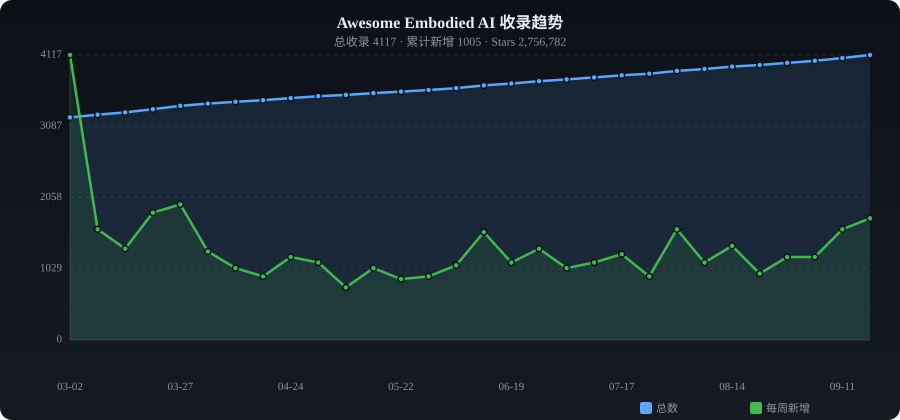

# ✨ Awesome Embodied AI

[English](./README.md) | **中文**

> 具身智能精选集合 —— 人形机器人、强化学习、灵巧操作、Sim-to-Real 等资源自动收录

   

---

## 📈 收录趋势

<p align="center"></p>

---

## 📊 分类统计

| 分类 | 数量 | 占比 |
|------|-----:|-----:|
| 🤖 人形机器人 | 659 | █████ 16.5% |
| 🐕 四足机器人 | 155 | █ 3.9% |
| 🤲 灵巧操作 | 560 | ████ 14.0% |
| 🎯 强化学习 | 956 | ███████ 23.9% |
| 🧠 模仿学习 & 基础模型 | 222 | █ 5.5% |
| 🌐 仿真 & Sim-to-Real | 366 | ███ 9.1% |
| 🗺️ 导航 & SLAM | 200 | █ 5.0% |
| 📊 数据集 & 基准 | 81 | █ 2.0% |
| 🔩 硬件 & 开源机器人 | 318 | ██ 7.9% |
| 📦 其他 | 486 | ████ 12.1% |

---

## 🔥 每周热门 (2026-08-28)

| # | 项目 | ⭐ | 📈 周增 | 描述 |
|:-:|------|---:|-------:|------|
| 1 | [cactus-compute/needle](https://github.com/cactus-compute/needle) | 9,506 | +1270 | Foundation model for tiny devices; 14mb, 26m param... |
| 2 | [mudler/LocalAI](https://github.com/mudler/LocalAI) | 44,075 | +544 | :robot:是免费的,开源替代的OpenAI,Claude和其他.自主托管和本地-第一. 投降替代... |
| 3 | [llm-as-a-verifier/llm-as-a-verifier](https://github.com/llm-as-a-verifier/llm-as-a-verifier) | 2,990 | +454 | LLM-as-a-Verifier is a general-purpose framework t... |
| 4 | [asimovinc/asimov-v1](https://github.com/asimovinc/asimov-v1) | 569 | +205 | v1 of Asimov, an open-source humanoid robot |
| 5 | [huggingface/lerobot](https://github.com/huggingface/lerobot) | 27,004 | +203 | 🤗 LeRobot:通过端到端学习,使人工智能更容易获得机器人 |
| 6 | [dorianborian/sesame-robot](https://github.com/dorianborian/sesame-robot) | 4,193 | +173 | 基于ESP32的开放且负担得起的小型四肢机器人. |
| 7 | [dexmal/opendm](https://github.com/dexmal/opendm) | 427 | +123 | An Open-World Foundation Model for General-Purpose... |
| 8 | [Octoday-Hub/Embodied-AI](https://github.com/Octoday-Hub/Embodied-AI) | 2,355 | +93 | 星期八 Octoday 「具身智能知识索引与产业地图」 |
| 9 | [sun254667/awesome-egocentric-vision](https://github.com/sun254667/awesome-egocentric-vision) | 114 | +78 | A curated, learning-friendly list of egocentric (f... |
| 10 | [NVIDIA/skills](https://github.com/NVIDIA/skills) | 3,121 | +75 | Agent Skills for NVIDIA products — install into Cl... |
| 11 | [Project-N-E-K-O/N.E.K.O](https://github.com/Project-N-E-K-O/N.E.K.O) | 2,694 | +75 | N.E.K.O. — A proactive, multi-modal AI companion f... |
| 12 | [sii-research/tau-0-vla](https://github.com/sii-research/tau-0-vla) | 585 | +73 | This repo is the official implementation of  "τ0-V... |
| 13 | [cactus-compute/cactus](https://github.com/cactus-compute/cactus) | 5,946 | +71 | Quantization, kernels, inference engine for mobile... |
| 14 | [RLinf/RLinf](https://github.com/RLinf/RLinf) | 4,668 | +67 | 强化体现和代理人工智能学习基础设施 |
| 15 | [NVlabs/GR00T-WholeBodyControl](https://github.com/NVlabs/GR00T-WholeBodyControl) | 3,450 | +62 | 欢迎来到 GR00T全身控制 (WBC) 网站!这是开发和部署先进的人类型控制器的统一平台.包括:N... |
| 16 | [Rhoban/microban](https://github.com/Rhoban/microban) | 216 | +59 | Microban is an affordable, fully 3D-printable, and... |
| 17 | [isaac-sim/IsaacLab](https://github.com/isaac-sim/IsaacLab) | 7,986 | +57 | 基于NVIDIA Isaac Sim的机器人学习的统一框架 |
| 18 | [noitom-robotics/AdaPT](https://github.com/noitom-robotics/AdaPT) | 84 | +52 | The official implementation of "AdaPT: Towards Pro... |
| 19 | [mithi/robotics-coursework](https://github.com/mithi/robotics-coursework) | 5,174 | +44 |  在线学习机器人 (等等) 的地方 |
| 20 | [OpenMOSS/Awesome-WAM](https://github.com/OpenMOSS/Awesome-WAM) | 1,346 | +44 | A curated, continuously updated reading list, pape... |

---

## 📁 分类目录

- [🤖 人形机器人](#humanoid) (659)
- [🐕 四足机器人](#quadruped) (155)
- [🤲 灵巧操作](#dexterous) (560)
- [🎯 强化学习](#rl) (956)
- [🧠 模仿学习 & 基础模型](#imitation) (222)
- [🌐 仿真 & Sim-to-Real](#sim2real) (366)
- [🗺️ 导航 & SLAM](#navigation) (200)
- [📊 数据集 & 基准](#dataset) (81)
- [🔩 硬件 & 开源机器人](#hardware) (318)
- [📦 其他](#other) (486)

---

### <a id="humanoid"></a>🤖 人形机器人

| 项目 | ⭐ | 语言 | 描述 |
|------|---:|:----:|------|
| [PetoiCamp/OpenCat-Quadruped-Robot](https://github.com/PetoiCamp/OpenCat-Quadruped-Robot) | 5,228 | C++ | An open source quadruped robot pet framework for developing Boston Dyn... |
| [dorianborian/sesame-robot](https://github.com/dorianborian/sesame-robot) | 4,193 | C | An open and affordable mini quadruped robot based on ESP32. |
| [RobotLocomotion/drake](https://github.com/RobotLocomotion/drake) | 3,921 | C++ | Model-based design and verification for robotics. |
| [NVlabs/GR00T-WholeBodyControl](https://github.com/NVlabs/GR00T-WholeBodyControl) | 3,450 | C++ | Welcome to GR00T Whole-Body Control (WBC)! This is a unified platform ... |
| [leggedrobotics/legged_gym](https://github.com/leggedrobotics/legged_gym) | 3,104 | Python | Isaac Gym Environments for Legged Robots |
| [leggedrobotics/rsl_rl](https://github.com/leggedrobotics/rsl_rl) | 2,918 | Python | A fast and simple implementation of learning algorithms for robotics. |
| [YanjieZe/awesome-humanoid-robot-learning](https://github.com/YanjieZe/awesome-humanoid-robot-learning) | 2,726 | Python | A Paper List for Humanoid Robot Learning. |
| [YanjieZe/GMR](https://github.com/YanjieZe/GMR) | 2,638 | Python | [ICRA 2026] GMR: General Motion Retargeting. Retarget human motions in... |
| [physical-superintelligence-lab/Psi0](https://github.com/physical-superintelligence-lab/Psi0) | 2,627 | Python | [RSS26'] Welcome to Psi-Zero, a Humanoid VLA towards Universal Humanoi... |
| [Nate711/StanfordDoggoProject](https://github.com/Nate711/StanfordDoggoProject) | 2,553 | - | Stanford Doggo is an open source quadruped robot that jumps, flips, an... |
| [Roboparty/roboto_origin](https://github.com/Roboparty/roboto_origin) | 2,349 | Python | Roboto_origin Fully Open-Source DIY Humanoid Robot/萝博头原型机全开源手搓级人形机器人 |
| [roboterax/humanoid-gym](https://github.com/roboterax/humanoid-gym) | 2,076 | Python | Humanoid-Gym: Reinforcement Learning for Humanoid Robot with Zero-Shot... |
| [magicleap/Atlas](https://github.com/magicleap/Atlas) | 1,852 | Python | Atlas: End-to-End 3D Scene Reconstruction from Posed Images |
| [qiayuanl/legged_control](https://github.com/qiayuanl/legged_control) | 1,795 | C++ | NMPC, WBC, state estimation, and sim2real framework for legged robots ... |
| [Skythinker616/foc-wheel-legged-robot](https://github.com/Skythinker616/foc-wheel-legged-robot) | 1,713 | C | Open source materials for a novel structured legged robot, including m... |
| [robocasa/robocasa](https://github.com/robocasa/robocasa) | 1,684 | Python | RoboCasa: Large-Scale Simulation of Everyday Tasks for Generalist Robo... |
| [robot-descriptions/awesome-robot-descriptions](https://github.com/robot-descriptions/awesome-robot-descriptions) | 1,642 | - | A curated list of awesome robot descriptions (URDF, MJCF) |
| [unitreerobotics/xr_teleoperate](https://github.com/unitreerobotics/xr_teleoperate) | 1,636 | Python | This repository implements teleoperation of the Unitree humanoid robot... |
| [erwincoumans/motion_imitation](https://github.com/erwincoumans/motion_imitation) | 1,459 | Python | Code accompanying the paper "Learning Agile Robotic Locomotion Skills ... |
| [PetoiCamp/OpenCat-Old](https://github.com/PetoiCamp/OpenCat-Old) | 1,371 | C++ | A programmable and highly maneuverable robotic cat for STEM education ... |
| [ZhengyiLuo/PHC](https://github.com/ZhengyiLuo/PHC) | 1,281 | Python | Official Implementation of the ICCV 2023 paper:  Perpetual Humanoid Co... |
| [HybridRobotics/Berkeley-Humanoid-Lite](https://github.com/HybridRobotics/Berkeley-Humanoid-Lite) | 1,262 | Python | Codebase for Berkeley Humanoid Lite |
| [unitreerobotics/unitree_ros](https://github.com/unitreerobotics/unitree_ros) | 1,241 | C++ |  |
| [rohanpsingh/LearningHumanoidWalking](https://github.com/rohanpsingh/LearningHumanoidWalking) | 1,207 | Python | Training a humanoid robot for locomotion using Reinforcement Learning |
| [menloresearch/asimov-1](https://github.com/menloresearch/asimov-1) | 1,146 | Python | v1 of Asimov, an open-source humanoid robot |
| [ethz-adrl/towr](https://github.com/ethz-adrl/towr) | 1,080 | C++ | A light-weight, Eigen-based C++ library for trajectory optimization fo... |
| [abizovnuralem/go2_omniverse](https://github.com/abizovnuralem/go2_omniverse) | 1,066 | Python | Unitree Go2, Unitree G1 support for Nvidia Isaac Lab (Isaac Gym / Isaa... |
| [rohanpsingh/learninghumanoidwalking](https://github.com/rohanpsingh/LearningHumanoidWalking) | 1,064 | Python | Training a humanoid robot for locomotion using Reinforcement Learning |
| [TeleHuman/PBHC](https://github.com/TeleHuman/PBHC) | 1,055 | Python | Official Implementation of "KungfuBot: Physics-Based Humanoid Whole-Bo... |
| [poppy-project/poppy-humanoid](https://github.com/poppy-project/poppy-humanoid) | 1,050 | Jupyter Notebook | Poppy Humanoid is an open-source and 3D printed humanoid robot. Optimi... |
| [asimovinc/asimov-1](https://github.com/asimovinc/asimov-1) | 1,041 | Shell | v1 of Asimov, an open-source humanoid robot |
| [LeCAR-Lab/dial-mpc](https://github.com/LeCAR-Lab/dial-mpc) | 996 | Python | Official implementation for the paper "Full-Order Sampling-Based MPC f... |
| [jonyzhang2023/awesome-humanoid-learning](https://github.com/jonyzhang2023/awesome-humanoid-learning) | 942 | - | Humanoid Robots Resources |
| [pollen-robotics/microduck](https://github.com/pollen-robotics/microduck) | 906 | Rust | A Tiny biped duck robot 🦆 |
| [Open-X-Humanoid/TienKung-Lab](https://github.com/Open-X-Humanoid/TienKung-Lab) | 870 | Python | Tien Kung-Lab: Direct IsaacLab Workflow for Legged Robots |
| [unitreerobotics/unitree_mujoco](https://github.com/unitreerobotics/unitree_mujoco) | 839 | C++ |  |
| [hongsukchoi/VideoMimic](https://github.com/hongsukchoi/VideoMimic) | 825 | Python | Visual Imitation Enables Contextual Humanoid Control. CoRL 2025, Best ... |
| [facebookresearch/metamotivo](https://github.com/facebookresearch/metamotivo) | 784 | Python | The first behavioral foundation model to control a virtual physics-bas... |
| [menloresearch/asimov-v0](https://github.com/menloresearch/asimov-v0) | 782 | - | v0 of Asimov, an open-source humanoid robot |
| [asimovinc/asimov-v0](https://github.com/asimovinc/asimov-v0) | 774 | - | v0 of Asimov, an open-source humanoid robot |

---

### <a id="quadruped"></a>🐕 四足机器人

| 项目 | ⭐ | 语言 | 描述 |
|------|---:|:----:|------|
| [ToanTech/py-apple-quadruped-robot](https://github.com/ToanTech/py-apple-quadruped-robot) | 1,303 | Python | 一个低成本大型全套四足机器人软硬件开源项目 |
| [mjbots/moteus](https://github.com/mjbots/moteus) | 1,155 | C++ | Brushless servo and quadrupedal robot |
| [curieuxjy/Awesome_Quadrupedal_Robots](https://github.com/curieuxjy/Awesome_Quadrupedal_Robots) | 1,154 | Python | Awesome Quadrupedal Robots |
| [mangdangroboticsclub/QuadrupedRobot](https://github.com/mangdangroboticsclub/QuadrupedRobot) | 1,150 | Python | Open-Source,ROS Robot Dog Kit |
| [FlorianWilk/SpotMicroAI](https://github.com/FlorianWilk/SpotMicroAI) | 452 | - | SpotMicro AI - How to build a self-learning Robot |
| [google-deepmind/barkour_robot](https://github.com/google-deepmind/barkour_robot) | 373 | C++ | Barkour Robot: Agile Quadruped Robots by Google DeepMind |
| [Derek-TH-Wang/quadruped_ctrl](https://github.com/Derek-TH-Wang/quadruped_ctrl) | 361 | C++ | MIT mini cheetah quadruped robot simulated in pybullet environment usi... |
| [aaedmusa/TOPS](https://github.com/aaedmusa/TOPS) | 297 | C++ | TOPS (Traverser of Planar Surfaces) or "SPOT" backwards is a 3D printe... |
| [TNY-Robotics/TNY-360](https://github.com/TNY-Robotics/TNY-360) | 295 | C++ | TNY - 360 Robot source code and 3d models |
| [chvmp/robots](https://github.com/chvmp/robots) | 276 | C | Collection of quadrupedal robots configured to work in CHAMP developme... |
| [haraduka/mevius](https://github.com/haraduka/mevius) | 253 | Python | A Quadruped Robot Easily Constructed through E-Commerce with Sheet Met... |
| [metadriverse/metaurban](https://github.com/metadriverse/metaurban) | 252 | Python | [ICLR 2025 Spotlight] MetaUrban: An Embodied AI Simulation Platform fo... |
| [ShuoYangRobotics/QuadrupedSim](https://github.com/ShuoYangRobotics/QuadrupedSim) | 249 | MATLAB | A quadruped robot simulator in Matlab/Simulink |
| [Tencent-RoboticsX/lifelike-agility-and-play](https://github.com/Tencent-RoboticsX/lifelike-agility-and-play) | 242 | Python | Project Page for Lifelike Agility and Play in Quadrupedal Robots using... |
| [khaledgabr77/unitree_go2_ros2](https://github.com/khaledgabr77/unitree_go2_ros2) | 164 | C++ | The package provides a complete ROS 2 Jazzy integration for the Unitre... |
| [SovGVD/esp32-robot-dog-code](https://github.com/SovGVD/esp32-robot-dog-code) | 153 | C++ | WIP: ESP32 powered robot dog, quadruped robot. This is just code, hard... |
| [haraduka/mevius2](https://github.com/haraduka/mevius2) | 152 | Python | Practical Open-Source Quadruped Robot with Sheet Metal Welding and Mul... |
| [lnotspotl/notspot_sim_py](https://github.com/lnotspotl/notspot_sim_py) | 135 | Python | This repository contains all the code and files needed to simulate the... |
| [lshil00/Quadruped_robot](https://github.com/lshil00/Quadruped_robot) | 131 | C | a 12-DOF quadruped robot design |
| [ViolinLee/NodeQuad12-MicroPython](https://github.com/ViolinLee/NodeQuad12-MicroPython) | 130 | Python | Spider quadruped robot using NodeMUC-32S (ESP32) and MicroPython. |
| [iit-DLSLab/muse](https://github.com/iit-DLSLab/muse) | 129 | C++ | A State Estimation Package for Quadruped Robots, that fuses Propriocep... |
| [anoochit/arduino-quadruped-robot](https://github.com/anoochit/arduino-quadruped-robot) | 125 | Arduino | Arduino Quadruped Robot, Spider Robot |
| [golaced/Quadruped-Robot-Moco-12-](https://github.com/golaced/Quadruped-Robot-Moco-12-) | 123 | Python | MOCO通用四足机器人控制器教程 |
| [ToanTech/py-apple-bldc-quadruped-robot](https://github.com/ToanTech/py-apple-bldc-quadruped-robot) | 122 | C++ | 这是菠萝狗四足机器人开源项目的分支，菠萝无刷系列开源四足机器人的专门仓库 |
| [UMich-CURLY/deep-contact-estimator](https://github.com/UMich-CURLY/deep-contact-estimator) | 117 | Python | Contact estimation for quadruped robots. |
| [HybridRobotics/quadruped_nmpc_dcbf_duality](https://github.com/HybridRobotics/quadruped_nmpc_dcbf_duality) | 117 | C++ |  |
| [facebookresearch/spot-sim2real](https://github.com/facebookresearch/spot-sim2real) | 103 | Python | Spot Sim2Real Infrastructure |
| [alexandrospetkos/quad](https://github.com/alexandrospetkos/quad) | 97 | Processing | Four Legged robot design |
| [ANYbotics/anymal_b_simple_description](https://github.com/ANYbotics/anymal_b_simple_description) | 95 | CMake | Simplified robot description of the ANYmal B quadrupedal robot. |
| [BAO162/Quadruped_MPC_matlab](https://github.com/BAO162/Quadruped_MPC_matlab) | 93 | MATLAB | Quadruped robot linear MPC control, platform Webots + MATLAB |
| [runeharlyk/SpotMicroESP32-Leika](https://github.com/runeharlyk/SpotMicroESP32-Leika) | 80 | C++ | My take on the quadruped Spot Micro robot. Its built around an ESP32 c... |
| [mujocolab/anymal_c_velocity](https://github.com/mujocolab/anymal_c_velocity) | 76 | Python | Integrating a custom robot (ANYmal C) with mjlab's velocity task |
| [ANYbotics/anymal_c_simple_description](https://github.com/ANYbotics/anymal_c_simple_description) | 75 | CMake | Simplified robot description of the ANYmal C quadrupedal robot. |
| [lnotspotl/a1_sim_py](https://github.com/lnotspotl/a1_sim_py) | 74 | Python | This is a temporary repository, which contains all the files needed to... |
| [RCILab/RCI_quadruped_robot_navigation](https://github.com/RCILab/RCI_quadruped_robot_navigation) | 71 | C++ | This repository integrates reinforcement learning (RL), navigation, an... |
| [uzh-rpg/event-based_object_catching_anymal](https://github.com/uzh-rpg/event-based_object_catching_anymal) | 71 | C++ | Code for "Event-based Agile Object Catching with a Quadrupedal Robot",... |
| [SoftServeSAG/spot_simulation](https://github.com/SoftServeSAG/spot_simulation) | 70 | - | This repository contains examples of simulation for Boston Dynamic's r... |
| [youngboss2026/Learn-It-All-Full-Stack-EmbodiedAI-Quadruped-Robot](https://github.com/youngboss2026/Learn-It-All-Full-Stack-EmbodiedAI-Quadruped-Robot) | 64 | - |  |
| [JackDemeter/quadruped-robot](https://github.com/JackDemeter/quadruped-robot) | 63 | Jupyter Notebook | Quadruped Robot for capstone project |
| [golaced/Moco-8-OpenSourced-Quadruped-Robot](https://github.com/golaced/Moco-8-OpenSourced-Quadruped-Robot) | 62 | C | 全开源8自由度四足机器人  欢迎Star |

---

### <a id="dexterous"></a>🤲 灵巧操作

| 项目 | ⭐ | 语言 | 描述 |
|------|---:|:----:|------|
| [MarkFzp/mobile-aloha](https://github.com/MarkFzp/mobile-aloha) | 4,465 | Jupyter Notebook | Mobile ALOHA: Learning Bimanual Mobile Manipulation with Low-Cost Whol... |
| [enactic/openarm](https://github.com/enactic/openarm) | 2,896 | MDX | A fully open-source humanoid arm for physical AI research and deployme... |
| [Lifelong-Robot-Learning/LIBERO](https://github.com/Lifelong-Robot-Learning/LIBERO) | 2,248 | Jupyter Notebook | Benchmarking Knowledge Transfer in Lifelong Robot Learning |
| [HCPLab-SYSU/Embodied_AI_Paper_List](https://github.com/HCPLab-SYSU/Embodied_AI_Paper_List) | 2,156 | - | [Embodied-AI-Survey-2025] Paper List and Resource Repository for Embod... |
| [thu-ml/RoboticsDiffusionTransformer](https://github.com/thu-ml/RoboticsDiffusionTransformer) | 1,780 | Python | RDT-1B: a Diffusion Foundation Model for Bimanual Manipulation |
| [real-stanford/universal_manipulation_interface](https://github.com/real-stanford/universal_manipulation_interface) | 1,565 | Python | Universal Manipulation Interface: In-The-Wild Robot Teaching Without I... |
| [facebookresearch/home-robot](https://github.com/facebookresearch/home-robot) | 1,234 | Python | Mobile manipulation research tools for roboticists |
| [andyzeng/visual-pushing-grasping](https://github.com/andyzeng/visual-pushing-grasping) | 1,110 | Python | Train robotic agents to learn to plan pushing and grasping actions for... |
| [huangwl18/ReKep](https://github.com/huangwl18/ReKep) | 983 | Python | ReKep: Spatio-Temporal Reasoning of Relational Keypoint Constraints fo... |
| [mees/calvin](https://github.com/mees/calvin) | 973 | Python | CALVIN - A benchmark for Language-Conditioned Policy Learning for Long... |
| [LeCAR-Lab/human2humanoid](https://github.com/LeCAR-Lab/human2humanoid) | 959 | Python | [IROS 2024] Learning Human-to-Humanoid Real-Time Whole-Body Teleoperat... |
| [vimalabs/VIMA](https://github.com/vimalabs/VIMA) | 857 | Python | Official Algorithm Implementation of ICML'23 Paper "VIMA: General Robo... |
| [huangwl18/VoxPoser](https://github.com/huangwl18/VoxPoser) | 833 | Python | VoxPoser: Composable 3D Value Maps for Robotic Manipulation with Langu... |
| [TheRobotStudio/HOPEJr](https://github.com/TheRobotStudio/HOPEJr) | 821 | C# | HOPEJr_open-source_DIY_Humanoid_Robot_with_dexterous_hands |
| [zubair-irshad/Awesome-Robotics-3D](https://github.com/zubair-irshad/Awesome-Robotics-3D) | 819 | - | A curated list of 3D Vision papers relating to Robotics domain in the ... |
| [capgym/cap-x](https://github.com/capgym/cap-x) | 760 | Python | A Framework for Benchmarking and Improving Coding Agents for Robot Man... |
| [LightwheelAI/leisaac](https://github.com/LightwheelAI/leisaac) | 719 | Python | LeIsaac provides teleoperation functionality in IsaacLab using the SO1... |
| [google-research/robopianist](https://github.com/google-research/robopianist) | 710 | Python | [CoRL '23] Dexterous piano playing with deep reinforcement learning. |
| [jimmyyhwu/tidybot](https://github.com/jimmyyhwu/tidybot) | 679 | Python | TidyBot: Personalized Robot Assistance with Large Language Models |
| [FlagOpen/Robo-Dopamine](https://github.com/FlagOpen/Robo-Dopamine) | 654 | Python | Official implementation of "Robo-Dopamine: General Process Reward Mode... |
| [skumra/robotic-grasping](https://github.com/skumra/robotic-grasping) | 630 | Python | Antipodal Robotic Grasping using GR-ConvNet. IROS 2020. |
| [jimmyyhwu/tidybot2](https://github.com/jimmyyhwu/tidybot2) | 613 | Python | TidyBot++: An Open-Source Holonomic Mobile Manipulator for Robot Learn... |
| [jhu-lcsr/handeye_calib_camodocal](https://github.com/jhu-lcsr/handeye_calib_camodocal) | 603 | C++ | Easy to use and accurate hand eye calibration which has been working r... |
| [FlagOpen/RoboBrain](https://github.com/FlagOpen/RoboBrain) | 564 | Python | [CVPR 2025] RoboBrain: A Unified Brain Model for Robotic Manipulation ... |
| [cliport/cliport](https://github.com/cliport/cliport) | 549 | Jupyter Notebook | CLIPort: What and Where Pathways for Robotic Manipulation |
| [NVlabs/PointWorld](https://github.com/NVlabs/PointWorld) | 511 | Python | PointWorld: Scaling 3D World Models for In-The-Wild Robotic Manipulati... |
| [peract/peract](https://github.com/peract/peract) | 497 | Python | Perceiver-Actor: A Multi-Task Transformer for Robotic Manipulation |
| [gaolongsen/GFVLA_CBF](https://github.com/gaolongsen/GFVLA_CBF) | 497 | Python | 🤖🧠🇦🇮👾 Graph VLA with Control Barrier Function in Dual-Arm Robotics Man... |
| [Psi-Robot/DexGraspVLA](https://github.com/Psi-Robot/DexGraspVLA) | 489 | Python | [AAAI'26 Oral] DexGraspVLA: A Vision-Language-Action Framework Towards... |
| [JiuTian-VL/Large-VLM-based-VLA-for-Robotic-Manipulation](https://github.com/JiuTian-VL/Large-VLM-based-VLA-for-Robotic-Manipulation) | 441 | - | A curated list of large VLM-based VLA models for robotic manipulation. |
| [Mondo-Robotics/DiT4DiT](https://github.com/Mondo-Robotics/DiT4DiT) | 437 | Python | This is the official code repo for DiT4DiT, a Vision-Action-Model (VAM... |
| [star2dust/paper-simulation](https://github.com/star2dust/paper-simulation) | 422 | MATLAB | Let's reproduce paper simulations of multi-robot systems, formation co... |
| [aadhithya14/Open-Teach](https://github.com/aadhithya14/Open-Teach) | 420 | C# | A Versatile Teleoperation framework for Robotic Manipulation using Met... |
| [huangwl18/PointWorld](https://github.com/huangwl18/PointWorld) | 419 | - | PointWorld: Scaling 3D World Models for In-The-Wild Robotic Manipulati... |
| [rhett-chen/Robotic-grasping-papers](https://github.com/rhett-chen/Robotic-grasping-papers) | 407 | - | paper list of robotic grasping and some related works |
| [NVlabs/RVT](https://github.com/NVlabs/RVT) | 398 | Jupyter Notebook | Official Code for RVT-2 and RVT |
| [isri-aist/RoboManipBaselines](https://github.com/isri-aist/RoboManipBaselines) | 395 | Python | A software framework integrating various imitation learning methods an... |
| [j96w/DexCap](https://github.com/j96w/DexCap) | 388 | Python | [RSS 2024] "DexCap: Scalable and Portable Mocap Data Collection System... |
| [microsoft/ChatGPT-Robot-Manipulation-Prompts](https://github.com/microsoft/ChatGPT-Robot-Manipulation-Prompts) | 386 | - |  |
| [malik-group/do-as-i-do](https://github.com/malik-group/do-as-i-do) | 386 | Python | Official Codebase for "Do as I Do: Dexterous Manipulation Data from Ev... |

---

### <a id="rl"></a>🎯 强化学习

| 项目 | ⭐ | 语言 | 描述 |
|------|---:|:----:|------|
| [localstack/localstack](https://github.com/localstack/localstack) | 64,509 | Python | 💻 A fully functional local AWS cloud stack. Develop and test your clou... |
| [openai/gym](https://github.com/openai/gym) | 37,057 | Python | A toolkit for developing and comparing reinforcement learning algorith... |
| [Genesis-Embodied-AI/genesis-world](https://github.com/Genesis-Embodied-AI/genesis-world) | 29,818 | Python | A generative world for general-purpose robotics & embodied AI learning... |
| [Genesis-Embodied-AI/Genesis](https://github.com/Genesis-Embodied-AI/Genesis) | 28,600 | Python | A generative world for general-purpose robotics & embodied AI learning... |
| [wekan/wekan](https://github.com/wekan/wekan) | 20,856 | JavaScript | The Open Source kanban, built with Meteor. GitHub issues/PRs are only ... |
| [volcengine/verl](https://github.com/verl-project/verl) | 19,481 | Python | verl: Volcano Engine Reinforcement Learning for LLMs |
| [Unity-Technologies/ml-agents](https://github.com/Unity-Technologies/ml-agents) | 19,189 | C# | The Unity Machine Learning Agents Toolkit (ML-Agents) is an open-sourc... |
| [Microsoft/AirSim](https://github.com/microsoft/AirSim) | 17,986 | C++ | Open source simulator for autonomous vehicles built on Unreal Engine /... |
| [lvwerra/trl](https://github.com/huggingface/trl) | 17,485 | Python | Train transformer language models with reinforcement learning. |
| [openai/baselines](https://github.com/openai/baselines) | 16,651 | Python | OpenAI Baselines: high-quality implementations of reinforcement learni... |
| [ShangtongZhang/reinforcement-learning-an-introduction](https://github.com/ShangtongZhang/reinforcement-learning-an-introduction) | 14,568 | Python | Python Implementation of Reinforcement Learning: An Introduction |
| [DLR-RM/stable-baselines3](https://github.com/DLR-RM/stable-baselines3) | 13,733 | Python | PyTorch version of Stable Baselines, reliable implementations of reinf... |
| [carla-simulator/carla](https://github.com/carla-simulator/carla) | 13,615 | C++ | Open-source simulator for autonomous driving research. |
| [owainlewis/awesome-artificial-intelligence](https://github.com/owainlewis/awesome-artificial-intelligence) | 13,005 | - | A curated list of Artificial Intelligence (AI) courses, books, video l... |
| [aikorea/awesome-rl](https://github.com/aikorea/awesome-rl) | 9,922 | - | Reinforcement learning resources curated |
| [OpenRLHF/OpenRLHF](https://github.com/OpenRLHF/OpenRLHF) | 9,060 | Python | An Easy-to-use, Scalable and High-performance Agentic RL Framework bas... |
| [openai/universe](https://github.com/openai/universe) | 7,512 | Python | Universe: a software platform for measuring and training an AI's gener... |
| [zsdonghao/tensorlayer](https://github.com/tensorlayer/TensorLayer) | 7,393 | Python | Deep Learning and Reinforcement Learning Library for Scientists and En... |
| [pliang279/awesome-multimodal-ml](https://github.com/pliang279/awesome-multimodal-ml) | 6,925 | - | Reading list for research topics in multimodal machine learning |
| [yandexdataschool/Practical_RL](https://github.com/yandexdataschool/Practical_RL) | 6,439 | Jupyter Notebook | A course in reinforcement learning in the wild |
| [jason718/awesome-self-supervised-learning](https://github.com/jason718/awesome-self-supervised-learning) | 6,413 | - | A curated list of awesome self-supervised methods |
| [ppwwyyxx/tensorpack](https://github.com/tensorpack/tensorpack) | 6,294 | Python | A Neural Net Training Interface on TensorFlow, with focus on speed + f... |
| [CarperAI/trlx](https://github.com/CarperAI/trlx) | 4,740 | Python | A repo for distributed training of language models with Reinforcement ... |
| [RLinf/RLinf](https://github.com/RLinf/RLinf) | 4,668 | Python | RLinf: Reinforcement Learning Infrastructure for Embodied and Agentic ... |
| [PKU-Alignment/align-anything](https://github.com/PKU-Alignment/align-anything) | 4,637 | Python | Align Anything: Training All-modality Model with Feedback |
| [deepmind/dm_control](https://github.com/google-deepmind/dm_control) | 4,466 | Python | Google DeepMind's software stack for physics-based simulation and Rein... |
| [GT-RIPL/Awesome-LLM-Robotics](https://github.com/GT-RIPL/Awesome-LLM-Robotics) | 4,458 | - | A comprehensive list of papers using large language/multi-modal models... |
| [opendilab/awesome-RLHF](https://github.com/opendilab/awesome-RLHF) | 4,421 | - | A curated list of reinforcement learning with human feedback resources... |
| [rlcode/reinforcement-learning](https://github.com/rlcode/reinforcement-learning) | 3,618 | Python | Minimal and Clean Reinforcement Learning Examples |
| [opendilab/DI-engine](https://github.com/opendilab/DI-engine) | 3,598 | Python | OpenDILab Decision AI Engine. The Most Comprehensive Reinforcement Lea... |
| [pytorch/rl](https://github.com/pytorch/rl) | 3,539 | Python | A modular, primitive-first, python-first PyTorch library for Reinforce... |
| [ob-f/OpenBot](https://github.com/ob-f/OpenBot) | 3,449 | Swift | OpenBot leverages smartphones as brains for low-cost robots. We have d... |
| [ShangtongZhang/DeepRL](https://github.com/ShangtongZhang/DeepRL) | 3,413 | Python | Modularized Implementation of Deep RL Algorithms in PyTorch |
| [reinforceio/tensorforce](https://github.com/tensorforce/tensorforce) | 3,312 | Python | Tensorforce: a TensorFlow library for applied reinforcement learning |
| [cirosantilli/china-dictatorship](https://github.com/cirosantilli/china-dictatorship) | 3,169 | HTML | 反中共政治宣传库。Anti Chinese government propaganda. 住在中国真名用户的网友请别给星星，不然你要被警察请... |
| [deepmind/trfl](https://github.com/google-deepmind/trfl) | 3,134 | Python | TensorFlow Reinforcement Learning |
| [unitreerobotics/unitree_rl_gym](https://github.com/unitreerobotics/unitree_rl_gym) | 3,076 | Python |  |
| [endymecy/awesome-deeplearning-resources](https://github.com/endymecy/awesome-deeplearning-resources) | 3,024 | - | Deep Learning and deep reinforcement learning research papers and some... |
| [tensorflow/agents](https://github.com/tensorflow/agents) | 2,991 | Python | TF-Agents: A reliable, scalable and easy to use TensorFlow library for... |
| [xbpeng/DeepMimic](https://github.com/xbpeng/DeepMimic) | 2,960 | C++ | Motion imitation with deep reinforcement learning. |

---

### <a id="imitation"></a>🧠 模仿学习 & 基础模型

| 项目 | ⭐ | 语言 | 描述 |
|------|---:|:----:|------|
| [huggingface/lerobot](https://github.com/huggingface/lerobot) | 27,004 | Python | 🤗 LeRobot: Making AI for Robotics more accessible with end-to-end lear... |
| [tzutalin/labelImg](https://github.com/HumanSignal/labelImg) | 24,803 | Python | LabelImg is now part of the Label Studio community. The popular image ... |
| [joonspk-research/generative_agents](https://github.com/joonspk-research/generative_agents) | 20,738 | - | Generative Agents: Interactive Simulacra of Human Behavior |
| [cactus-compute/needle](https://github.com/cactus-compute/needle) | 9,506 | Python | Foundation model for tiny devices; 14mb, 26m params, 1-6k toks/sec on ... |
| [cactus-compute/cactus](https://github.com/cactus-compute/cactus) | 5,946 | C++ | Quantization, kernels, inference engine for mobiles, wearables, smart ... |
| [openvla/openvla](https://github.com/openvla/openvla) | 5,367 | Python | OpenVLA: An open-source vision-language-action model for robotic manip... |
| [geohot/qira](https://github.com/geohot/qira) | 4,062 | C | QEMU Interactive Runtime Analyser |
| [ysymyth/ReAct](https://github.com/ysymyth/ReAct) | 3,581 | Jupyter Notebook | [ICLR 2023] ReAct: Synergizing Reasoning and Acting in Language Models |
| [MarkFzp/act-plus-plus](https://github.com/MarkFzp/act-plus-plus) | 3,577 | Python | Imitation learning algorithms with Co-training for Mobile ALOHA: ACT, ... |
| [jonyzhang2023/awesome-embodied-vla-va-vln](https://github.com/jonyzhang2023/awesome-embodied-vla-va-vln) | 3,485 | - | A curated list of state-of-the-art research in embodied AI, focusing o... |
| [OpenDriveLab/AgiBot-World](https://github.com/OpenDriveLab/AgiBot-World) | 2,798 | Python | [IROS 2025 Best Paper Award Finalist & IEEE TRO 2026] The Large-scale ... |
| [Project-N-E-K-O/N.E.K.O](https://github.com/Project-N-E-K-O/N.E.K.O) | 2,694 | Python | N.E.K.O. — A proactive, multi-modal AI companion featuring 24/7 ambien... |
| [stevenlovegrove/Pangolin](https://github.com/stevenlovegrove/Pangolin) | 2,687 | C++ | Pangolin is a lightweight portable rapid development library for manag... |
| [naiveHobo/InvoiceNet](https://github.com/naiveHobo/InvoiceNet) | 2,678 | Python | Deep neural network to extract intelligent information from invoice do... |
| [Octoday-Hub/Embodied-AI](https://github.com/Octoday-Hub/Embodied-AI) | 2,355 | - | 星期八 Octoday 「具身智能知识索引与产业地图」 |
| [mapbox/robosat](https://github.com/mapbox/robosat) | 2,050 | Python | Semantic segmentation on aerial and satellite imagery. Extracts featur... |
| [robotics-survey/Awesome-Robotics-Foundation-Models](https://github.com/robotics-survey/Awesome-Robotics-Foundation-Models) | 1,399 | - |  |
| [PDAL/PDAL](https://github.com/PDAL/PDAL) | 1,340 | C++ | PDAL is Point Data Abstraction Library. GDAL for point cloud data. |
| [BaiShuanghao/Awesome-Robotics-Manipulation](https://github.com/BaiShuanghao/Awesome-Robotics-Manipulation) | 1,110 | - | A comprehensive list of papers about Robot Manipulation, including pap... |
| [balena-os/meta-balena](https://github.com/balena-os/meta-balena) | 983 | BitBake | A collection of Yocto layers used to build balenaOS images |
| [SMRT-AIST/interactive_slam](https://github.com/koide3/interactive_slam) | 940 | C++ | Interactive Map Correction for 3D Graph SLAM |
| [Denghaoyuan123/Awesome-RL-VLA](https://github.com/Denghaoyuan123/Awesome-RL-VLA) | 838 | - | A Survey on Reinforcement Learning of Vision-Language-Action Models fo... |
| [Auromix/ROS-LLM](https://github.com/Auromix/ROS-LLM) | 828 | Python | ROS-LLM is a framework designed for embodied intelligence applications... |
| [walzimmer/3d-bat](https://github.com/walzimmer/3d-bat) | 800 | TypeScript | 3D Bounding Box Annotation Tool (3D-BAT) Point cloud and Image Labelin... |
| [terminators2025/RealMirror](https://github.com/terminators2025/RealMirror) | 787 | JavaScript | RealMirror, a comprehensive, open-source embodied AI VLA platform. |
| [AnjieCheng/NaVILA](https://github.com/AnjieCheng/NaVILA) | 704 | Python | [RSS'25] This repository is the implementation of "NaVILA: Legged Robo... |
| [FluxVLA/FluxVLA](https://github.com/FluxVLA/FluxVLA) | 636 | Python | An all-in-one VLA engineering platform for embodied AI — from data to ... |
| [notmahi/dobb-e](https://github.com/notmahi/dobb-e) | 621 | G-code | Dobb·E: An open-source, general framework for learning household robot... |
| [fracapuano/robot-learning-tutorial](https://github.com/fracapuano/robot-learning-tutorial) | 571 | TeX | All the source code for "Robot Learning: A Tutorial". Get involved to ... |
| [OpenDriveLab/WholebodyVLA](https://github.com/OpenDriveLab/WholebodyVLA) | 553 | - | [ICLR 2026] Towards Unified Latent VLA for Whole-body Loco-manipulatio... |
| [InternRobotics/InternVLA-A-series](https://github.com/InternRobotics/InternVLA-A-series) | 544 | Python | InternVLA-A1: Unifying Understanding, Generation, and Action for Robot... |
| [pxvr-official/1](https://github.com/pxvr-official/1) | 516 | - | 無許諾配信 企業理念剽窃 動物の森収益化 大神ミオ権利者削除 戌神権利侵害発言 常闇トワ炎上 夜空メルストーカー被害 建築王サポーター放置 ... |
| [Jiaaqiliu/Awesome-VLA-Robotics](https://github.com/Jiaaqiliu/Awesome-VLA-Robotics) | 491 | - | A comprehensive list of excellent research papers, models, datasets, a... |
| [microsoft/VITRA](https://github.com/microsoft/VITRA) | 483 | Python | [ICRA 2026] VITRA: Scalable Vision-Language-Action Model Pretraining f... |
| [JeffreyYH/Awesome-Generalist-Robots-via-Foundation-Models](https://github.com/JeffreyYH/Awesome-Generalist-Robots-via-Foundation-Models) | 468 | - | Paper list in the survey paper: Toward General-Purpose Robots via Foun... |
| [OpenMOSS/VLABench](https://github.com/OpenMOSS/VLABench) | 468 | Python | Official repo of VLABench, a large scale benchmark designed for fairly... |
| [allenai/procthor](https://github.com/allenai/procthor) | 465 | Python | 🏘️ Scaling Embodied AI by Procedurally Generating Interactive 3D House... |
| [NVlabs/RoboLab](https://github.com/NVlabs/RoboLab) | 463 | Python | A simulation benchmarking platform for evaluating generalist robot pol... |
| [Shuijing725/awesome-robot-social-navigation](https://github.com/Shuijing725/awesome-robot-social-navigation) | 457 | - | A curated list of robot social navigation. |
| [JeffreyYH/robotics-fm-survey](https://github.com/JeffreyYH/Awesome-Generalist-Robots-via-Foundation-Models) | 454 | - | Paper list in the survey paper: Toward General-Purpose Robots via Foun... |

---

### <a id="sim2real"></a>🌐 仿真 & Sim-to-Real

| 项目 | ⭐ | 语言 | 描述 |
|------|---:|:----:|------|
| [bulletphysics/bullet3](https://github.com/bulletphysics/bullet3) | 14,701 | C++ | Bullet Physics SDK: real-time collision detection and multi-physics si... |
| [google-deepmind/mujoco](https://github.com/google-deepmind/mujoco) | 12,149 | C++ | Multi-Joint dynamics with Contact. A general purpose physics simulator... |
| [isaac-sim/IsaacLab](https://github.com/isaac-sim/IsaacLab) | 7,986 | Python | Unified framework for robot learning built on NVIDIA Isaac Sim |
| [NVIDIA/warp](https://github.com/NVIDIA/warp) | 7,040 | Python | A Python framework for GPU-accelerated simulation, robotics, and machi... |
| [facebookresearch/habitat-sim](https://github.com/facebookresearch/habitat-sim) | 3,802 | C++ | A flexible, high-performance 3D simulator for Embodied AI research. |
| [mani-skill/ManiSkill](https://github.com/mani-skill/ManiSkill) | 3,267 | Python | SAPIEN Manipulation Skill Framework, an open source GPU parallelized r... |
| [NVIDIA/skills](https://github.com/NVIDIA/skills) | 3,121 | Python | Agent Skills for NVIDIA products — install into Claude Code, Codex, an... |
| [facebookresearch/habitat-lab](https://github.com/facebookresearch/habitat-lab) | 3,110 | Python | A modular high-level library to train embodied AI agents across a vari... |
| [deepmind/mujoco_menagerie](https://github.com/google-deepmind/mujoco_menagerie) | 3,082 | Python | A collection of high-quality models for the MuJoCo physics engine, cur... |
| [google-deepmind/mujoco_menagerie](https://github.com/google-deepmind/mujoco_menagerie) | 3,082 | Python | A collection of high-quality models for the MuJoCo physics engine, cur... |
| [haosulab/ManiSkill](https://github.com/haosulab/ManiSkill) | 2,957 | Python | SAPIEN Manipulation Skill Framework, an open source GPU parallelized r... |
| [google-deepmind/mujoco_playground](https://github.com/google-deepmind/mujoco_playground) | 2,168 | Jupyter Notebook | An open-source library for GPU-accelerated robot learning and sim-to-r... |
| [microsoft/PromptCraft-Robotics](https://github.com/microsoft/PromptCraft-Robotics) | 2,115 | Python | Community for applying LLMs to robotics and a robot simulator with Cha... |
| [gazebosim/gz-sim](https://github.com/gazebosim/gz-sim) | 1,470 | C++ | Open source robotics simulator. The latest version of Gazebo. |
| [sychaichangkun/ROS-Academy-for-Beginners](https://github.com/sychaichangkun/ROS-Academy-for-Beginners) | 1,333 | CMake | 中国大学MOOC《机器人操作系统入门》代码示例    ROS tutorial |
| [InternRobotics/InternUtopia](https://github.com/InternRobotics/InternUtopia) | 1,286 | Python | A simulation platform for versatile Embodied AI research and developme... |
| [OpenRobotLab/GRUtopia](https://github.com/InternRobotics/InternUtopia) | 1,209 | Python | A simulation platform for versatile Embodied AI research and developme... |
| [Genesis-Embodied-AI/RoboGen](https://github.com/Genesis-Embodied-AI/RoboGen) | 1,151 | Python | A generative and self-guided robotic agent that endlessly propose and ... |
| [Unity-Technologies/com.unity.perception](https://github.com/Unity-Technologies/com.unity.perception) | 994 | C# | Perception toolkit for sim2real training and validation in Unity |
| [Geonhee-LEE/mpc_ros](https://github.com/Geonhee-LEE/mpc_ros) | 973 | C++ | Differential Wheeled Mobile Robot - Nonlinear Model Predictive Control... |
| [eureka-research/DrEureka](https://github.com/eureka-research/DrEureka) | 939 | Python | Official Repository for "DrEureka: Language Model Guided Sim-To-Real T... |
| [uuvsimulator/uuv_simulator](https://github.com/uuvsimulator/uuv_simulator) | 888 | Python | Gazebo/ROS packages for underwater robotics simulation |
| [haosulab/SAPIEN](https://github.com/haosulab/SAPIEN) | 825 | C++ | SAPIEN Embodied AI Platform |
| [zeroth-robotics/zeroth-bot](https://github.com/zeroth-robotics/zeroth-bot) | 819 | - | 3D-printed open-source humanoid robot platform for sim-to-real and RL |
| [StanfordVL/iGibson](https://github.com/StanfordVL/iGibson) | 810 | Python | A Simulation Environment to train Robots in Large Realistic Interactiv... |
| [ika-rwth-aachen/Cam2BEV](https://github.com/ika-rwth-aachen/Cam2BEV) | 790 | Python | TensorFlow Implementation for Computing a Semantically Segmented Bird'... |
| [mithi/hexapod](https://github.com/mithi/hexapod) | 786 | JavaScript | Blazing fast hexapod robot simulator for the web. |
| [leggedrobotics/pace-sim2real](https://github.com/leggedrobotics/pace-sim2real) | 688 | Python | PACE: A systematic approach for sim-to-real transfer of legged robots,... |
| [Rhoban/onshape-to-robot](https://github.com/Rhoban/onshape-to-robot) | 595 | Python | Converting Onshape assembly to robot definition (URDF, SDF, MuJoCo) th... |
| [legubiao/quadruped_ros2_control](https://github.com/legubiao/quadruped_ros2_control) | 563 | C++ | ROS2-Control implementations for Quadruped robots, include sim2real |
| [spear-sim/spear](https://github.com/spear-sim/spear) | 563 | C++ | SPEAR: A Simulator for Photorealistic Embodied AI Research |
| [RoboVerseOrg/Simulately](https://github.com/RoboVerseOrg/Simulately) | 551 | TypeScript | A universal summary of current robotics simulators |
| [isaac-sim/IsaacLab-Arena](https://github.com/isaac-sim/IsaacLab-Arena) | 548 | Python | Isaac Lab - Arena is a robotics simulation framework that enhances NVI... |
| [unitreerobotics/unitree_sim_isaaclab](https://github.com/unitreerobotics/unitree_sim_isaaclab) | 543 | Python | The Unitree simulation environment built based on Isaac Lab |
| [ROBOTIS-GIT/turtlebot3_simulations](https://github.com/ROBOTIS-GIT/turtlebot3_simulations) | 523 | C++ | Simulations for TurtleBot3 |
| [URLab-Sim/UnrealRoboticsLab](https://github.com/URLab-Sim/UnrealRoboticsLab) | 518 | C++ | A high-fidelity, open-source robotics simulator integrating Unreal Eng... |
| [lihuang3/ur5_ROS-Gazebo](https://github.com/lihuang3/ur5_ROS-Gazebo) | 514 | Python | Universal Robot (UR5) Pick and Place Simulation in ROS-Gazebo with a U... |
| [Patryk27/kartoffels](https://github.com/Patryk27/kartoffels) | 506 | - | a game where you're given a potato and your job is to implement a firm... |
| [Bithack/principia](https://github.com/Bithack/principia) | 407 | C++ | Open source physics-based sandbox game with electronic circuitry, mech... |
| [StoneT2000/lerobot-sim2real](https://github.com/StoneT2000/lerobot-sim2real) | 397 | Python | LeRobot sim2real code. Train in fast simulation and deploy visual poli... |

---

### <a id="navigation"></a>🗺️ 导航 & SLAM

| 项目 | ⭐ | 语言 | 描述 |
|------|---:|:----:|------|
| [AtsushiSakai/PythonRobotics](https://github.com/AtsushiSakai/PythonRobotics) | 28,757 | Python | Python sample codes and textbook for robotics algorithms. |
| [googlecartographer/cartographer](https://github.com/cartographer-project/cartographer) | 7,789 | C++ | Cartographer is a system that provides real-time simultaneous localiza... |
| [TixiaoShan/LIO-SAM](https://github.com/TixiaoShan/LIO-SAM) | 4,546 | C++ | LIO-SAM: Tightly-coupled Lidar Inertial Odometry via Smoothing and Map... |
| [MichaelGrupp/evo](https://github.com/MichaelGrupp/evo) | 4,139 | Python | Python package for the evaluation of odometry and SLAM |
| [Ly0n/awesome-robotic-tooling](https://github.com/Ly0n/awesome-robotic-tooling) | 3,885 | - | Tooling for professional robotic development in C++ and Python with a ... |
| [openstreetmap/iD](https://github.com/openstreetmap/iD) | 3,735 | JavaScript | 🆔 The easy-to-use OpenStreetMap editor in JavaScript. |
| [ANYbotics/grid_map](https://github.com/ANYbotics/grid_map) | 3,225 | C++ | Universal grid map library for mobile robotic mapping |
| [luigifreda/pyslam](https://github.com/luigifreda/pyslam) | 3,118 | Python | pySLAM is a hybrid Python/C++ Visual SLAM pipeline supporting monocula... |
| [jslee02/awesome-robotics-libraries](https://github.com/jslee02/awesome-robotics-libraries) | 3,027 | Python | :sunglasses: A curated list of robotics libraries and software |
| [xdspacelab/openvslam](https://github.com/xdspacelab/openvslam) | 2,987 | - | OpenVSLAM: A Versatile Visual SLAM Framework |
| [tum-vision/lsd_slam](https://github.com/tum-vision/lsd_slam) | 2,702 | C++ | LSD-SLAM |
| [ros-planning/navigation](https://github.com/ros-planning/navigation) | 2,660 | C++ | ROS Navigation stack.  Code for finding where the robot is and how it ... |
| [henki-robotics/robotics_essentials_ros2](https://github.com/henki-robotics/robotics_essentials_ros2) | 2,586 | C++ | Learn the basics of robotics through hands-on experience using ROS 2 a... |
| [HKUST-Aerial-Robotics/A-LOAM](https://github.com/HKUST-Aerial-Robotics/A-LOAM) | 2,366 | C++ | Advanced implementation of LOAM |
| [koide3/hdl_graph_slam](https://github.com/koide3/hdl_graph_slam) | 2,245 | C++ | 3D LIDAR-based Graph SLAM |
| [3D-Vision-World/awesome-NeRF-and-3DGS-SLAM](https://github.com/3D-Vision-World/awesome-NeRF-and-3DGS-SLAM) | 2,112 | - | A comprehensive list of Implicit Representations, NeRF and 3D Gaussian... |
| [ROBOTIS-GIT/turtlebot3](https://github.com/ROBOTIS-GIT/turtlebot3) | 2,049 | C++ | ROS packages for Turtlebot3 |
| [MIT-SPARK/Kimera](https://github.com/MIT-SPARK/Kimera) | 2,035 | - | Index repo for Kimera code |
| [ompl/ompl](https://github.com/ompl/ompl) | 1,965 | C++ | The Open Motion Planning Library (OMPL) |
| [zchoi/Awesome-Embodied-Robotics-and-Agent](https://github.com/zchoi/Awesome-Embodied-Robotics-and-Agent) | 1,860 | - | This is a curated list of "Embodied AI or robot with Large Language Mo... |
| [ANYbotics/elevation_mapping](https://github.com/ANYbotics/elevation_mapping) | 1,857 | C++ | Robot-centric elevation mapping for rough terrain navigation |
| [changh95/visual-slam-roadmap](https://github.com/changh95/visual-slam-roadmap) | 1,763 | - | Roadmap to become a Visual-SLAM developer in 2026 |
| [zchoi/Awesome-Embodied-Agent-with-LLMs](https://github.com/zchoi/Awesome-Embodied-Robotics-and-Agent) | 1,717 | - | This is a curated list of "Embodied AI or robot with Large Language Mo... |
| [pypose/pypose](https://github.com/pypose/pypose) | 1,605 | Python | A library for differentiable robotics on manifolds. |
| [zubair-irshad/Awesome-Implicit-NeRF-Robotics](https://github.com/zubair-irshad/Awesome-Implicit-NeRF-Robotics) | 1,566 | - | A comprehensive list of Implicit Representations and NeRF papers relat... |
| [rst-tu-dortmund/teb_local_planner](https://github.com/rst-tu-dortmund/teb_local_planner) | 1,342 | C++ | An optimal trajectory planner considering distinctive topologies for m... |
| [pierrepault/probabilistic_robotics](https://github.com/pierrepault/probabilistic_robotics) | 1,318 | C++ | solution of exercises of the book "probabilistic robotics" |
| [pptacher/probabilistic_robotics](https://github.com/pptacher/probabilistic_robotics) | 1,317 | C++ | solution of exercises of the book "probabilistic robotics" |
| [pantor/ruckig](https://github.com/pantor/ruckig) | 1,144 | C++ | Motion Generation for Robots and Machines. Real-time. Jerk-constrained... |
| [hanruihua/NeuPAN](https://github.com/hanruihua/NeuPAN) | 1,090 | Python | [TRO 2025] NeuPAN: Direct Point Robot Navigation with End-to-End Model... |
| [hyye/lio-mapping](https://github.com/hyye/lio-mapping) | 1,000 | C++ | Implementation of Tightly Coupled 3D Lidar Inertial Odometry and Mappi... |
| [naturerobots/mesh_navigation](https://github.com/naturerobots/mesh_navigation) | 891 | C++ | The Mesh Navigation Stack: Efficient Mobile Robot Navigation in Uneven... |
| [SteveMacenski/spatio_temporal_voxel_layer](https://github.com/SteveMacenski/spatio_temporal_voxel_layer) | 856 | C++ | A new voxel layer leveraging modern 3D graphics tools to modernize nav... |
| [hungpham2511/toppra](https://github.com/hungpham2511/toppra) | 841 | Python | robotic motion planning library |
| [mathiasmantelli/awesome-mobile-robotics](https://github.com/mathiasmantelli/awesome-mobile-robotics) | 782 | - | Useful links of different content related to AI, Computer Vision, and ... |
| [vlmaps/vlmaps](https://github.com/vlmaps/vlmaps) | 719 | Python | [ICRA2023] Implementation of Visual Language Maps for Robot Navigation |
| [zhuhu00/Awesome_Dynamic_SLAM](https://github.com/zhuhu00/Awesome_Dynamic_SLAM) | 713 | - | Dynamic SLAM, Life-long SLAM Research(Lidar, Visual, Sensor Fusion etc... |
| [jizhang-cmu/ground_based_autonomy_basic](https://github.com/jizhang-cmu/ground_based_autonomy_basic) | 709 | C++ | Autonomous Navigation and Collision Avoidance for Ground Robots |
| [ChanganVR/awesome-embodied-vision](https://github.com/ChanganVR/awesome-embodied-vision) | 703 | - | Reading list for research topics in embodied vision |
| [AtsushiSakai/MATLABRobotics](https://github.com/AtsushiSakai/MATLABRobotics) | 685 | Matlab | MATLAB sample codes for mobile robot navigation |

---

### <a id="dataset"></a>📊 数据集 & 基准

| 项目 | ⭐ | 语言 | 描述 |
|------|---:|:----:|------|
| [mlflow/mlflow](https://github.com/mlflow/mlflow) | 24,485 | Python | The open source developer platform to build AI agents and models with ... |
| [openai/evals](https://github.com/openai/evals) | 17,929 | Python | Evals is a framework for evaluating LLMs and LLM systems, and an open-... |
| [opencv/cvat](https://github.com/cvat-ai/cvat) | 15,380 | Python | Annotate better with CVAT, the industry-leading data engine for machin... |
| [mozilla/TTS](https://github.com/mozilla/TTS) | 10,168 | Jupyter Notebook | :robot: :speech_balloon: Deep learning for Text to Speech  (Discussion... |
| [llm-as-a-verifier/llm-as-a-verifier](https://github.com/llm-as-a-verifier/llm-as-a-verifier) | 2,990 | Python | LLM-as-a-Verifier is a general-purpose framework that provides fine-gr... |
| [RoboTwin-Platform/RoboTwin](https://github.com/RoboTwin-Platform/RoboTwin) | 2,784 | Python | RoboTwin 2.0 Offical Repo |
| [UniversalDataTool/universal-data-tool](https://github.com/UniversalDataTool/universal-data-tool) | 2,054 | JavaScript | Collaborate & label any type of data, images, text, or documents, in a... |
| [m2n037/awesome-mecheng](https://github.com/m2n037/awesome-mecheng) | 1,672 | - | Awesome Mechanical Engineering Resources |
| [uzh-rpg/rpg_trajectory_evaluation](https://github.com/uzh-rpg/rpg_trajectory_evaluation) | 1,187 | Python | Toolbox for quantitative trajectory evaluation of VO/VIO |
| [abisee/cnn-dailymail](https://github.com/abisee/cnn-dailymail) | 658 | Python | Code to obtain the CNN / Daily Mail dataset (non-anonymized) for summa... |
| [allenai/vla-evaluation-harness](https://github.com/allenai/vla-evaluation-harness) | 569 | Python | One framework to evaluate any VLA model on any robot simulation benchm... |
| [mint-lab/awesome-robotics-datasets](https://github.com/mint-lab/awesome-robotics-datasets) | 516 | - | A collection of useful datasets for robotics and computer vision |
| [deepmind/narrativeqa](https://github.com/google-deepmind/narrativeqa) | 507 | Shell | This repository contains the NarrativeQA dataset. It includes the list... |
| [askforalfred/alfred](https://github.com/askforalfred/alfred) | 489 | C | ALFRED - A Benchmark for Interpreting Grounded Instructions for Everyd... |
| [google-research-datasets/ToTTo](https://github.com/google-research-datasets/ToTTo) | 461 | - | ToTTo is an open-domain English table-to-text dataset with over 120,00... |
| [EmbodiedBench/EmbodiedBench](https://github.com/EmbodiedBench/EmbodiedBench) | 335 | Python | [ICML 2025 Oral] Official repo of EmbodiedBench,  a comprehensive benc... |
| [Yuxing-Wang-THU/SurveyBrainBody](https://github.com/Yuxing-Wang-THU/SurveyBrainBody) | 314 | - | Embodied Co-Design for Rapidly Evolving Agents: Taxonomy, Frontiers, a... |
| [embodied-agent-interface/embodied-agent-interface](https://github.com/embodied-agent-interface/embodied-agent-interface) | 298 | Python | Embodied Agent Interface (EAI): Benchmarking LLMs for Embodied Decisio... |
| [Gepetto/example-robot-data](https://github.com/Gepetto/example-robot-data) | 290 | Python | Set of robot URDFs for benchmarking and developed examples. |
| [ori-mrg/robotcar-dataset-sdk](https://github.com/ori-mrg/robotcar-dataset-sdk) | 288 | MATLAB | Software Development Kit for the Oxford Robotcar Dataset |
| [OpenHelix-Team/RoboMemArena](https://github.com/OpenHelix-Team/RoboMemArena) | 195 | Python | RoboMemArena: A Comprehensive and Challenging Robotic Memory Benchmark |
| [gundam-global-challenge/gundam_robot](https://github.com/gundam-global-challenge/gundam_robot) | 191 | Python | ROS packages for GUNDAM robots |
| [InternRobotics/InternManip](https://github.com/InternRobotics/InternManip) | 175 | Python | An All-in-one robot manipulation learning suite for policy models trai... |
| [RoboMME/robomme_benchmark](https://github.com/RoboMME/robomme_benchmark) | 156 | Python | Benchmarking memory-augmented robotic generalist policies |
| [google-research/robel](https://github.com/google-research/robel) | 150 | Python | ROBEL: Robotics Benchmarks for Learning with low-cost robots |
| [nyu-mll/BBQ](https://github.com/nyu-mll/BBQ) | 138 | Python | Repository for the Bias Benchmark for QA dataset. |
| [andrewda/awesome-frc](https://github.com/andrewda/awesome-frc) | 125 | - | A curated list of packages and resources regarding the FIRST Robotics ... |
| [TUM-ICS/BIRDy](https://github.com/TUM-ICS/BIRDy) | 119 | MATLAB | Benchmark for Identification of Robot Dynamics |
| [suhaisheng/RoboSense](https://github.com/suhaisheng/RoboSense) | 118 | Python | RoboSense: Large-scale Dataset and Benchmark for Egocentric Robot Perc... |
| [sun254667/awesome-egocentric-vision](https://github.com/sun254667/awesome-egocentric-vision) | 114 | - | A curated, learning-friendly list of egocentric (first-person) vision ... |
| [robo-arena/roboarena](https://github.com/robo-arena/roboarena) | 112 | Python | Distributed, scalable benchmarking of generalist robot policies. |
| [ricber/digital-agriculture-datasets](https://github.com/ricber/digital-agriculture-datasets) | 112 | - | Open datasets for training and benchmarking AI and robotic systems in ... |
| [KavrakiLab/motion_bench_maker](https://github.com/KavrakiLab/motion_bench_maker) | 111 | C++ | Generate and benchmark datasets for robot manipulation problems |
| [csiro-robotics/Wild-Places](https://github.com/csiro-robotics/Wild-Places) | 102 | Python | 🏞️ [IEEE ICRA2023]  The official repository for paper "Wild-Places: A ... |
| [lbaa2022/LLMTaskPlanning](https://github.com/lbaa2022/LLMTaskPlanning) | 94 | Jupyter Notebook | LoTa-Bench: Benchmarking Language-oriented Task Planners for Embodied ... |
| [Aryia-Behroziuan/neurons](https://github.com/Aryia-Behroziuan/neurons) | 93 | - | An ANN is a model based on a collection of connected units or nodes ca... |
| [shengyin1224/SafeAgentBench](https://github.com/shengyin1224/SafeAgentBench) | 76 | Python | Codes for paper "SafeAgentBench: A Benchmark for Safe Task Planning of... |
| [lobehub/awesome-rsi](https://github.com/lobehub/awesome-rsi) | 71 | - | A curated research map of Recursive Self-Improvement (RSI): models, ag... |
| [StanfordVL/behavior](https://github.com/StanfordVL/behavior) | 69 | Python | Code to evaluate a solution in the BEHAVIOR benchmark: starter code, b... |
| [Chenyang-ZHU/YOLOv3-Based-Face-Detection-Tracking](https://github.com/Chenyang-ZHU/YOLOv3-Based-Face-Detection-Tracking) | 62 | Python | This is a robot project for television live. System will tracking the ... |

---

### <a id="hardware"></a>🔩 硬件 & 开源机器人

| 项目 | ⭐ | 语言 | 描述 |
|------|---:|:----:|------|
| [coqui-ai/TTS](https://github.com/coqui-ai/TTS) | 44,673 | Python | 🐸💬 - a deep learning toolkit for Text-to-Speech, battle-tested in rese... |
| [mudler/LocalAI](https://github.com/mudler/LocalAI) | 44,075 | Go | :robot: The free, Open Source alternative to OpenAI, Claude and others... |
| [FreeCAD/FreeCAD](https://github.com/FreeCAD/FreeCAD) | 28,807 | C++ | Official source code of FreeCAD, a free and opensource multiplatform 3... |
| [mithi/robotics-coursework](https://github.com/mithi/robotics-coursework) | 5,174 | - | 🤖 Places where you can learn robotics (and stuff like that) online 🤖 |
| [cyberbotics/webots](https://github.com/cyberbotics/webots) | 4,580 | C++ | Webots Robot Simulator |
| [HKUST-Aerial-Robotics/VINS-Fusion](https://github.com/HKUST-Aerial-Robotics/VINS-Fusion) | 4,392 | C++ | An optimization-based multi-sensor state estimator |
| [Microsoft/malmo](https://github.com/microsoft/malmo) | 4,251 | Java | Project Malmo is a platform for Artificial Intelligence experimentatio... |
| [Unity-Technologies/Unity-Robotics-Hub](https://github.com/Unity-Technologies/Unity-Robotics-Hub) | 2,568 | C# | Central repository for tools, tutorials, resources, and documentation ... |
| [MicrosoftDocs/live-share](https://github.com/microsoft/live-share) | 2,362 | - | Real-time collaborative development from the comfort of your favorite ... |
| [fkromer/awesome-ros2](https://github.com/fkromer/awesome-ros2) | 2,133 | - | The Robot Operating System Version 2.0 is awesome! |
| [googlecartographer/cartographer_ros](https://github.com/cartographer-project/cartographer_ros) | 1,806 | C++ | Provides ROS integration for Cartographer. |
| [mathworks-robotics/awesome-matlab-robotics](https://github.com/mathworks-robotics/awesome-matlab-robotics) | 1,701 | - | This is a list of awesome demos, tutorials, utilities and overall reso... |
| [ahundt/awesome-robotics](https://github.com/ahundt/awesome-robotics) | 1,479 | - | A curated list of awesome links and software libraries that are useful... |
| [ros-industrial/universal_robot](https://github.com/ros-industrial/universal_robot) | 1,373 | C++ | ROS-Industrial Universal Robots support (https://wiki.ros.org/universa... |
| [PRBonn/depth_clustering](https://github.com/PRBonn/depth_clustering) | 1,294 | C++ | :taxi: Fast and robust clustering of point clouds generated with a Vel... |
| [BR-IDL/PaddleViT](https://github.com/BR-IDL/PaddleViT) | 1,238 | Python | :robot: PaddleViT: State-of-the-art Visual Transformer and MLP Models ... |
| [dartsim/dart](https://github.com/dartsim/dart) | 1,197 | C++ | C++20 physics engine for robotics and animation with collision, constr... |
| [louiszengCN/CarlaAir](https://github.com/louiszengCN/CarlaAir) | 1,079 | C++ | CarlaAir: Fly Drones Inside a CARLA World!! A Unified Infrastructure f... |
| [msadowski/awesome-weekly-robotics](https://github.com/msadowski/awesome-weekly-robotics) | 1,064 | - | A list of projects that were or will be featured in Weekly Robotics ne... |
| [neka-nat/cupoch](https://github.com/neka-nat/cupoch) | 1,038 | C++ | Robotics with GPU computing |
| [RoseCityRobotics/ai-developer-resources](https://github.com/RoseCityRobotics/ai-developer-resources) | 764 | - | I am Duncan, a cofounder at Rose City Robotics. This public repository... |
| [MapIV/eagleye](https://github.com/MapIV/eagleye) | 745 | C++ | Precise localization based on GNSS and IMU. |
| [robot-descriptions/robot_descriptions.py](https://github.com/robot-descriptions/robot_descriptions.py) | 725 | Python | Access 175+ robot descriptions from the main Python robotics framework... |
| [awesome-vacuum/awesome-vacuum](https://github.com/awesome-vacuum/awesome-vacuum) | 580 | - | A curated list of free and open source software and hardware to build ... |
| [Zhefan-Xu/isaac-go2-ros2](https://github.com/Zhefan-Xu/isaac-go2-ros2) | 575 | Python | Unitree Go2 simulation platform for testing navigation, decision-makin... |
| [micro-ROS/micro_ros_arduino](https://github.com/micro-ROS/micro_ros_arduino) | 541 | C | micro-ROS library for Arduino |
| [KumarRobotics/ublox](https://github.com/KumarRobotics/ublox) | 519 | C++ | A driver for ublox gps |
| [iit-DLSLab/Quadruped-PyMPC](https://github.com/iit-DLSLab/Quadruped-PyMPC) | 506 | Python | A model predictive controller for quadruped robots based on the single... |
| [umfieldrobotics/OceanSim](https://github.com/umfieldrobotics/OceanSim) | 491 | Python | [IROS 2025] OceanSim: A GPU-Accelerated Underwater Robot Perception Si... |
| [OpenLegged/URDF-Studio](https://github.com/OpenLegged/URDF-Studio) | 464 | TypeScript | URDF-Studio is a web-based visual URDF robot modeler with 3D workspace... |
| [AaronMR/Learning_ROS_for_Robotics_Programming_2nd_edition](https://github.com/AaronMR/Learning_ROS_for_Robotics_Programming_2nd_edition) | 461 | C++ | Code and examples for Learning ROS for Robotics Programming - 2nd Edit... |
| [frankaemika/franka_ros](https://github.com/frankarobotics/franka_ros) | 455 | C++ | ROS integration for Franka research robots |
| [mikeferguson/robot_calibration](https://github.com/mikeferguson/robot_calibration) | 452 | C++ | Generic calibration for robots |
| [facontidavide/rosbag_editor](https://github.com/facontidavide/rosbag_editor) | 445 | C++ | Create a rosbag from a given one, using a simple GUI |
| [SeriousOldMan/Simulator-Controller](https://github.com/SeriousOldMan/Simulator-Controller) | 435 | AutoHotkey | A virtual AI-based pit crew  for Sim Racing. Use the latest GPT techno... |
| [Unity-Technologies/ROS-TCP-Connector](https://github.com/Unity-Technologies/ROS-TCP-Connector) | 435 | C# |  |
| [ms-iot/vscode-ros](https://github.com/ms-iot/vscode-ros) | 434 | TypeScript | Visual Studio Code extension for Robot Operating System (ROS) developm... |
| [softmata/horus](https://github.com/softmata/horus) | 426 | Rust | Fastest Robotics Runtime System.  If phones have Android, robots deser... |
| [wenbowen123/iros20-6d-pose-tracking](https://github.com/wenbowen123/iros20-6d-pose-tracking) | 424 | Python | [IROS 2020] se(3)-TrackNet: Data-driven 6D Pose Tracking by Calibratin... |
| [ROBOTIS-GIT/OpenCR](https://github.com/ROBOTIS-GIT/OpenCR) | 420 | C | Software for ROS Embedded board (a.k.a. OpenCR). OpenCR means Open-sou... |

---

### <a id="other"></a>📦 其他

| 项目 | ⭐ | 语言 | 描述 |
|------|---:|:----:|------|
| [sindresorhus/awesome](https://github.com/sindresorhus/awesome) | 441,523 | - | 😎 Awesome lists about all kinds of interesting topics |
| [josephmisiti/awesome-machine-learning](https://github.com/josephmisiti/awesome-machine-learning) | 71,775 | Python | A curated list of awesome Machine Learning frameworks, libraries and s... |
| [protocolbuffers/protobuf](https://github.com/protocolbuffers/protobuf) | 70,768 | C++ | Protocol Buffers - Google's data interchange format |
| [google-research/bert](https://github.com/google-research/bert) | 39,875 | Python | TensorFlow code and pre-trained models for BERT |
| [google-research/google-research](https://github.com/google-research/google-research) | 37,373 | Jupyter Notebook | Google Research |
| [microsoft/visual-chatgpt](https://github.com/chenfei-wu/TaskMatrix) | 34,244 | Python |  |
| [ChristosChristofidis/awesome-deep-learning](https://github.com/ChristosChristofidis/awesome-deep-learning) | 27,629 | - | A curated list of awesome Deep Learning tutorials, projects and commun... |
| [imthenachoman/How-To-Secure-A-Linux-Server](https://github.com/imthenachoman/How-To-Secure-A-Linux-Server) | 24,641 | - | An evolving how-to guide for securing a Linux server. |
| [semantic-release/semantic-release](https://github.com/semantic-release/semantic-release) | 23,369 | JavaScript | :package::rocket: Fully automated version management and package publi... |
| [jbhuang0604/awesome-computer-vision](https://github.com/jbhuang0604/awesome-computer-vision) | 23,090 | - | A curated list of awesome computer vision resources |
| [antonmedv/fx](https://github.com/antonmedv/fx) | 20,305 | Go | Terminal JSON viewer & processor |
| [pybind/pybind11](https://github.com/pybind/pybind11) | 17,738 | C++ | Seamless operability between C++11 and Python |
| [bcicen/ctop](https://github.com/bcicen/ctop) | 17,632 | Go | Top-like interface for container metrics |
| [TianxingChen/Embodied-AI-Guide](https://github.com/TianxingChen/Embodied-AI-Guide) | 15,661 | - | [Lumina具身智能社区] 具身智能技术指南 Embodied-AI-Guide |
| [dask/dask](https://github.com/dask/dask) | 13,752 | Python | Parallel computing with task scheduling |
| [kjw0612/awesome-deep-vision](https://github.com/kjw0612/awesome-deep-vision) | 11,135 | - | A curated list of deep learning resources for computer vision |
| [libvips/libvips](https://github.com/libvips/libvips) | 11,124 | C | A fast image processing library with low memory needs. |
| [nasa/fprime](https://github.com/nasa/fprime) | 10,784 | C++ | F´ - A flight software and embedded systems framework |
| [OptimalScale/LMFlow](https://github.com/OptimalScale/LMFlow) | 8,493 | Python | An Extensible Toolkit for Finetuning and Inference of Large Foundation... |
| [sameersbn/docker-gitlab](https://github.com/sameersbn/docker-gitlab) | 8,085 | Shell | Dockerized GitLab |
| [NVIDIA/Isaac-GR00T](https://github.com/NVIDIA/Isaac-GR00T) | 7,944 | Jupyter Notebook | NVIDIA Isaac GR00T N1.6 -  A Foundation Model for Generalist Robots. |
| [deepmind/lab](https://github.com/google-deepmind/lab) | 7,332 | C | A customisable 3D platform for agent-based AI research |
| [MineDojo/Voyager](https://github.com/MineDojo/Voyager) | 7,162 | JavaScript | An Open-Ended Embodied Agent with Large Language Models |
| [kiloreux/awesome-robotics](https://github.com/kiloreux/awesome-robotics) | 6,984 | - | A list of awesome Robotics resources |
| [microsoft/DeepSpeedExamples](https://github.com/deepspeedai/DeepSpeedExamples) | 6,791 | Python | Example models using DeepSpeed |
| [gopasspw/gopass](https://github.com/gopasspw/gopass) | 6,727 | Go | The slightly more awesome standard unix password manager for teams |
| [kjw0612/awesome-rnn](https://github.com/kjw0612/awesome-rnn) | 6,205 | - | Recurrent Neural Network - A curated list of resources dedicated to RN... |
| [Kiloreux/awesome-robotics](https://github.com/kiloreux/awesome-robotics) | 6,199 | - | A list of awesome Robotics resources |
| [TheRobotStudio/SO-ARM100](https://github.com/TheRobotStudio/SO-ARM100) | 5,571 | - | Standard Open Arm 100 |
| [STVIR/pysot](https://github.com/STVIR/pysot) | 4,586 | Python | SenseTime Research platform for single object tracking, implementing a... |
| [andreasfertig/cppinsights](https://github.com/andreasfertig/cppinsights) | 4,468 | C++ | C++ Insights - See your source code with the eyes of a compiler |
| [KDE/heaptrack](https://github.com/KDE/heaptrack) | 4,003 | C++ | A heap memory profiler for Linux |
| [raboof/nethogs](https://github.com/raboof/nethogs) | 3,590 | C++ | Linux 'net top' tool |
| [NVIDIA/flownet2-pytorch](https://github.com/NVIDIA/flownet2-pytorch) | 3,274 | Python | Pytorch implementation of FlowNet 2.0: Evolution of Optical Flow Estim... |
| [openai/human-eval](https://github.com/openai/human-eval) | 3,146 | Python | Code for the paper "Evaluating Large Language Models Trained on Code" |
| [bigscience-workshop/promptsource](https://github.com/bigscience-workshop/promptsource) | 2,996 | Python | Toolkit for creating, sharing and using natural language prompts. |
| [MuShibo/Micro-Wheeled_leg-Robot](https://github.com/MuShibo/Micro-Wheeled_leg-Robot) | 2,696 | C++ | 全球最小的桌面级双轮腿机器人！ |
| [KimiNewt/pyshark](https://github.com/KimiNewt/pyshark) | 2,474 | Python | Python wrapper for tshark, allowing python packet parsing using wiresh... |
| [strasdat/Sophus](https://github.com/strasdat/Sophus) | 2,378 | C++ | C++ implementation of Lie Groups using Eigen. |
| [NVIDIA/libcudacxx](https://github.com/NVIDIA/libcudacxx) | 2,308 | C++ | [ARCHIVED] The C++ Standard Library for your entire system. See https:... |

---

## 🚀 快速开始

```bash
git clone https://github.com/lllray/awesome-embodied-a.git
```

---

## 🤝 贡献

欢迎提交 Pull Request 推荐优质项目！

---

## 📜 License

[](https://creativecommons.org/licenses/by-sa/4.0/)


---

<p align="center"><sub>✨ 自动整理 · 2026-08-28 19:31:01</sub></p>
